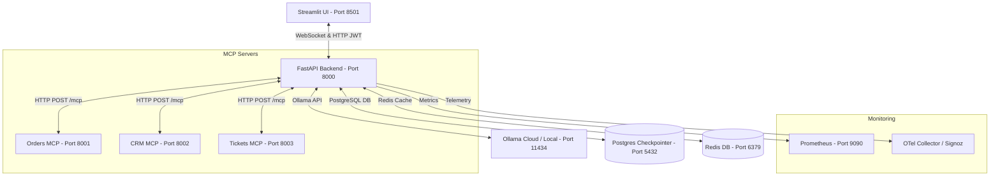
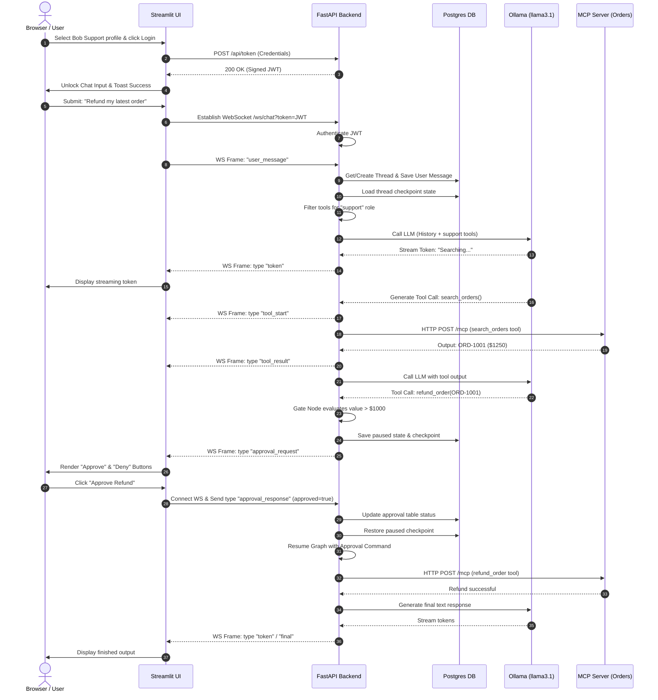

# Lifecycle & Control Flow Walkthrough

This document traces the complete execution lifecycle of the **Production Agent Platform** from the user's initial browser access to database persistence, tool calling, and LLM streaming.

---

## 1. High-Level Architecture Overview

Before tracing individual clicks, here is how the containers interact in the system:



---

## 2. Step-by-Step Execution Flow

### Step 2.1: Initial Access & UI Initialization
1. **User action:** Accesses `http://localhost:8501` in the browser.
2. **Streamlit Execution:**
   - [app.py](file:///c:/Users/Abhilash/customer/frontend/app.py) runs from top to bottom.
   - Streamlit initializes session state values:
     - `st.session_state.token = None` (No JWT yet)
     - `st.session_state.thread_id = "thread_demo_1"` (Default thread ID)
     - `st.session_state.messages = []` (Empty chat logs)
     - `st.session_state.approval_request = None` (No active interrupts)
   - The UI shows an information card in the main area: 
     > 👈 Please select a user profile in the sidebar and log in to start.
   - The sidebar renders a select box populated with mock profiles (Alice Admin, Bob Support, Charlie Viewer, etc.).

---

### Step 2.2: Profile Selection & Authentication
1. **User action:** The user selects **"Bob Support (Tenant A - support)"** and clicks **"Log In / Change Role"**.
2. **Token Generation Request:**
   - Streamlit fires an HTTP POST request to the FastAPI backend at `http://backend:8000/api/token`.
   - The request payload is:
     ```json
     {
       "user_id": "user_support_1",
       "tenant_id": "tenant_a",
       "role": "support"
     }
     ```
3. **Backend Middleware & Token Signing:**
   - FastAPI parses the payload.
   - Signs a secure HS256 JWT using `JWT_SECRET`, encoding the user identity (`user_support_1`), tenant context (`tenant_a`), and role (`support`).
   - Returns the token to the frontend:
     ```json
     {
       "access_token": "eyJhbGciOi...",
       "token_type": "bearer"
     }
     ```
4. **UI Updates:**
   - Streamlit saves the token into `st.session_state.token` and related fields.
   - The app clears previous message lists and displays a toast notification: `Logged in as Bob Support!`.
   - The main area unlocks the chat input box.

---

### Step 2.3: User Submits a Chat Message
1. **User action:** The user types `"Refund my latest order"` and hits Enter.
2. **Streamlit State Change:**
   - The message is appended to `st.session_state.messages` to render on-screen.
   - Streamlit calls the asynchronous function `stream_ws_chat()` in [ws_client.py](file:///c:/Users/Abhilash/customer/frontend/ws_client.py) with parameters:
     - `backend_url`: `"ws://backend:8000/ws/chat"`
     - `token`: `<Bob's JWT>`
     - `thread_id`: `"thread_demo_1"`
     - `content`: `"Refund my latest order"`

---

### Step 2.4: Establishing the WebSocket Connection
1. **WebSocket Connection Handshake:**
   - The client connects to `ws://backend:8000/ws/chat?token=<Bob's JWT>`.
   - **Backend Verification:**
     - FastAPI's endpoint interceptor in [websocket.py](file:///c:/Users/Abhilash/customer/backend/api/websocket.py) extracts the token query parameter.
     - Calls `decode_token()`. If invalid or expired, the socket closes immediately.
     - On successful validation, it extracts the `user_id`, `tenant_id`, and `role` from the payload and registers the connection (incrementing the active Prometheus metric `ACTIVE_SESSIONS`).
2. **WebSocket Message Payload Transmission:**
   - The client sends the user message payload over the websocket:
     ```json
     {
       "type": "user_message",
       "thread_id": "thread_demo_1",
       "content": "Refund my latest order"
     }
     ```

---

### Step 2.5: LangGraph Invocation & Orchestration
1. **Backend Routing (Message parsing):**
   - The backend WebSocket handler spawns a background asyncio task calling `run_graph_and_stream()`.
2. **Conversation History Load/Create:**
   - The backend calls the PostgreSQL database to check if the thread already exists.
   - If new, it registers a conversation record tied to the tenant (`tenant_a`) and user (`user_support_1`).
   - The backend inserts the incoming message content into the `messages` table.
3. **Graph State Construction:**
   - Instantiates the LangGraph state input dictionary:
     ```python
     input_data = {
         "messages": [HumanMessage(content="Refund my latest order")],
         "user_id": "user_support_1",
         "tenant_id": "tenant_a",
         "role": "support",
         "token": "<JWT_TOKEN>",
         "conversation_id": "<UUID>",
         "approval_required": False,
         "pending_approval": None
     }
     ```
4. **Execution Start:**
   - The backend runs `graph_builder.graph.astream_events(input_data, config=config, version="v2")`.
   - The checkpointer (`PostgresSaver`) reads the thread configuration and begins recording state snapshots at every transition point.

---

### Step 2.6: The Decision Cycle (LLM & Dynamic Tool Filtering)
1. **LLM Node Entry (`llm_node`):**
   - The state is evaluated. The system fetches the available tools for the current session.
   - **Dynamic Role-Based Tool Filtering:**
     - The backend dynamically queries `get_tools_for_role(role="support")`.
     - In this example:
       - `admin` role gets all tools (`refund_order`, `lookup_crm`, `create_ticket`).
       - `support` role gets restricted tools (e.g. `lookup_crm`, `create_ticket`, and conditional tools, but cannot execute high-value actions without authorization).
       - `viewer` role gets zero tools.
   - **LLM Call:**
     - The LLM node initializes `ChatOllama` (talking to `llama3.1` at `http://host.docker.internal:11434`).
     - Binds the filtered tools using `.bind_tools()`.
     - Invokes the LLM with the message history.
2. **LLM Response & Streaming:**
   - As Ollama processes, the backend captures `on_chat_model_stream` events token-by-token.
   - Each token is packaged and sent over the WebSocket to the frontend as:
     ```json
     {"type": "token", "content": "Checking"}
     ```
   - Streamlit displays the characters live.
3. **Tool Call Generation:**
   - The LLM decides it needs to query orders or customer CRM details to find the latest order.
   - The LLM outputs a tool call: `search_orders(query="latest")` or similar.
   - The graph transitions to the `tool` node.

---

### Step 2.7: Tool Execution & MCP Clients
1. **Tool Invocation (`tool_node`):**
   - The backend intercepts the tool request.
   - Sends a `tool_start` event over WebSocket to Streamlit:
     ```json
     {"type": "tool_start", "tool_name": "search_orders"}
     ```
   - Streamlit displays an info box: `🔧 Starting tool: search_orders`.
2. **MCP Communication:**
   - The backend acts as an MCP client. It forwards the request to the corresponding MCP server (e.g., Orders MCP at `http://orders_mcp:8001/mcp`) over HTTP.
   - **Tenant Context Injection:**
     - The client injects the `tenant_id` and the secure `token` into the MCP request headers, ensuring Bob Support cannot view orders from Tenant B.
3. **Tool Output & Tracing:**
   - The Orders MCP server processes the search query, fetches records from its local mock store, and returns:
     ```json
     {"status": "success", "orders": [{"order_id": "ORD-1001", "amount": 1250.00}]}
     ```
   - The backend records tool metrics (latency, calls, success) in Prometheus and exports trace spans to OpenTelemetry.
   - The tool results are serialized, saved to the database, and sent over the WebSocket:
     ```json
     {"type": "tool_result", "tool_name": "search_orders", "output": "..."}
     ```
   - Streamlit renders the tool output inside an expandable box.

---

### Step 2.8: Human-In-The-Loop Interrupt (The Refund Process)
1. **LLM Evaluation of Tool Outputs:**
   - The graph loops back to the LLM node.
   - The LLM identifies that the latest order is `ORD-1001` with an amount of `$1,250.00`.
   - To refund this order, the LLM outputs a tool call to `refund_order(order_id="ORD-1001", amount=1250.00)`.
2. **State Gate Checking (`refund_approval`):**
   - Before executing the `refund_order` tool, the graph executes the conditional edge or gate node checking approval rules.
   - **Rule:** Any refund exceeding `$1,000.00` requires supervisor review.
   - **Interrupt Execution:**
     - The backend flags `approval_required: True` and saves the tool arguments in the state's `pending_approval`.
     - The graph raises an `interrupt(...)` or pauses using `interrupt_before=["tool"]`.
     - The execution state is frozen and serialized by `PostgresSaver` in database tables.
3. **Notification over WebSocket:**
   - The backend pushes an `approval_request` event over the WebSocket:
     ```json
     {
       "type": "approval_request",
       "content": "A refund of $1250.00 for order ORD-1001 requires approval."
     }
     ```
   - The stream finishes with a final flag, and the WebSocket connection closes.
4. **UI Response:**
   - Streamlit detects the `approval_request` event and renders two action buttons in the chat viewport:
     - **👍 Approve Refund**
     - **👎 Deny Refund**
   - Execution sits idle, waiting for user input.

---

### Step 2.9: Resuming from Interrupt
1. **User Action:** The user clicks **"👍 Approve Refund"**.
2. **Websocket Reconnection & Resumption:**
   - Streamlit executes `send_ws_approval()` in [ws_client.py](file:///c:/Users/Abhilash/customer/frontend/ws_client.py).
   - Re-establishes the WebSocket connection with the JWT token.
   - Sends the response packet:
     ```json
     {
       "type": "approval_response",
       "thread_id": "thread_demo_1",
       "approved": true
     }
     ```
3. **Backend Execution Resume:**
   - The backend receives the approval packet, updates the status in the DB `approvals` table.
   - Resumes the graph using:
     ```python
     graph_builder.graph.astream_events(
         Command(resume={"approved": True, "reviewer_id": "user_support_1"}), 
         config=config, 
         version="v2"
     )
     ```
   - The checkpointer loads the graph state from PostgreSQL and restores execution right at the paused point.
4. **Tool Execution:**
   - The `refund_order` tool is evaluated under the active approval block. Since it is approved, it calls the Orders MCP server to apply the refund.
   - The results of the refund are returned.
5. **Final Agent Answer:**
   - The LLM generates the final textual confirmation (e.g. *"Refund for ORD-1001 has been approved and processed."*).
   - The message tokens are streamed to the browser.
   - The final output is saved to the Postgres messages archive.
   - The stream yields a `final` event, closing the session.

---

## 3. Sequential Interaction Flowchart

The diagram below details the sequential flow of messages between all layers:


