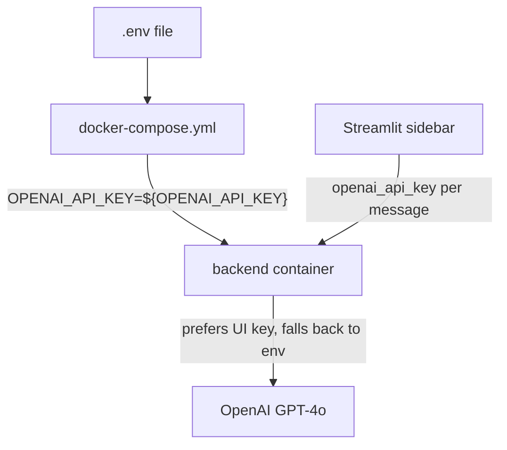

# .env.example

> **Source:** `.env.example`  
> **Purpose:** Template for environment variables used by Docker Compose and the backend.

---

## Variables

| Variable | Example value | Required? | Description |
|----------|---------------|-----------|-------------|
| `OPENAI_API_KEY` | `your-openai-api-key` | Optional* | API key for OpenAI GPT-4o used by the LangGraph agent |
| `LANGCHAIN_TRACING_V2` | `false` | No | Enable LangSmith tracing when `true` |
| `LANGCHAIN_API_KEY` | *(empty)* | No | LangSmith API key for trace upload |
| `LANGCHAIN_PROJECT` | `customer-support` | No | Project name in LangSmith dashboard |
| `JWT_SECRET` | `your-secret-key` | Yes | Shared secret for signing/verifying JWT tokens |

\* **OpenAI key alternatives:** You can either set `OPENAI_API_KEY` here **or** enter the key in the Streamlit sidebar. When entered in the UI, it is sent with each WebSocket message as `openai_api_key` and stored only in the browser session — never persisted on the server.

---

## How variables flow



---

## Setup

```bash
cp .env.example .env
# Edit .env with your real keys
```

---

## MCP novice notes

- `.env` is loaded by `backend/config.py` via `pydantic-settings`.
- `JWT_SECRET` must match the value in `docker-compose.yml` for `orders_mcp` and `backend` — otherwise order tool calls will fail authentication.
- MCP server URLs are **not** in `.env.example` because Docker Compose sets them directly in `docker-compose.yml`.
