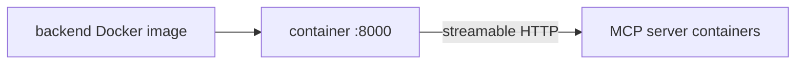

# backend/Dockerfile

> **Source:** `backend/Dockerfile`  
> **Purpose:** Container image definition for the FastAPI + LangGraph backend service.

---

## Build steps

| Step | Command | Description |
|------|---------|-------------|
| 1 | `FROM python:3.11-slim` | Base image with Python 3.11 |
| 2 | `WORKDIR /app` | Set working directory |
| 3 | `COPY requirements.txt .` | Copy dependencies first (Docker layer cache) |
| 4 | `RUN pip install --no-cache-dir -r requirements.txt` | Install all packages including `mcp`, `langgraph` |
| 5 | `COPY . .` | Copy backend source code |
| 6 | `EXPOSE 8000` | Document the listening port |
| 7 | `CMD ["python", "main.py"]` | Start uvicorn via `main.py` |

---

## What runs inside

When the container starts:

1. `main.py` calls `uvicorn.run("main:app", host="0.0.0.0", port=8000)`
2. Lifespan hook connects to Postgres, Redis, and three MCP servers
3. LangGraph agent compiles with PostgreSQL checkpointer
4. Server listens for HTTP and WebSocket requests

---

## MCP connection

The Dockerfile itself has no MCP-specific configuration. MCP server URLs come from environment variables set in `docker-compose.yml`:

```
ORDERS_MCP_URL=http://orders_mcp:8001/mcp
CRM_MCP_URL=http://crm_mcp:8002/mcp
TICKETS_MCP_URL=http://tickets_mcp:8003/mcp
```



---

## MCP novice notes

The backend container is an **MCP client host** — it runs the code that connects outward to MCP servers. It does not expose an MCP server endpoint itself.
