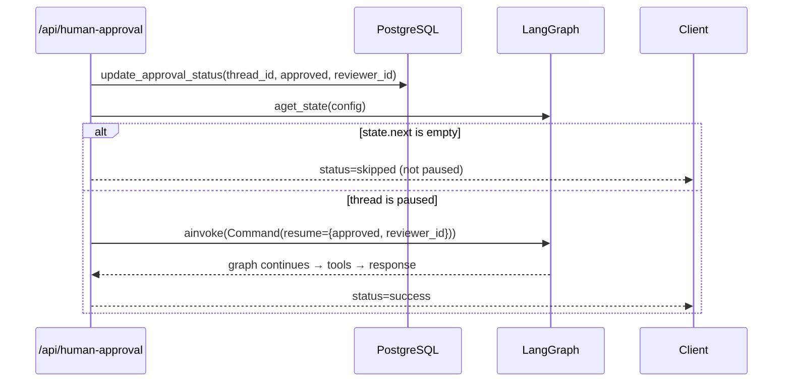

# backend/api/approval.py

> **Source:** `backend/api/approval.py`  
> **Purpose:** REST endpoint to resume a LangGraph thread paused for human approval (refunds > $1,000). Alternative to approving via WebSocket.

---

## Imports

| Import | Library | Why used |
|--------|---------|----------|
| `logging` | stdlib | Log approval decisions |
| `APIRouter, HTTPException` | `fastapi` | HTTP routing and errors |
| `BaseModel` | `pydantic` | Request body validation |
| `Command` | `langgraph.types` | Resume a paused graph with payload |
| `postgres_db` | `db.postgres` | Update approval record in DB |
| `graph_builder` | `graph.builder` | Access compiled LangGraph |

---

## Class: `ApprovalPayload(BaseModel)`

| Field | Type | Description |
|-------|------|-------------|
| `thread_id` | `str` | LangGraph thread ID (same as WebSocket `thread_id`) |
| `approved` | `bool` | `true` to approve, `false` to deny |
| `reviewer_id` | `str` | ID of the supervisor making the decision |

---

## Function: `resolve_approval(payload: ApprovalPayload)` — POST `/api/human-approval`

**Parameters:** `payload` — approval decision  
**Returns:** `{"status": "success", "message": "..."}` or `{"status": "skipped", ...}`  
**Raises:** HTTP 500 if graph not initialized or resume fails

**Logic flow:**

1. **Update DB** — marks approval row as `approved` or `denied`
2. **Check graph state** — `state.next` must be non-empty (graph is paused at interrupt)
3. **Resume** — `Command(resume={"approved": ..., "reviewer_id": ...})` unblocks `approval_node`
4. Graph continues to `tool_node` (if approved) or returns denial message

---

## MCP connection

After resume, if approved, the graph re-enters `tool_node` which executes `refund_order_v1` via the **Orders MCP client**. The REST endpoint doesn't call MCP directly — LangGraph handles it.

---

## MCP novice notes

This endpoint mirrors what the Streamlit UI does via WebSocket `approval_response`. Both paths use LangGraph's `Command(resume=...)` to continue a paused agent workflow before the MCP refund tool actually runs.
