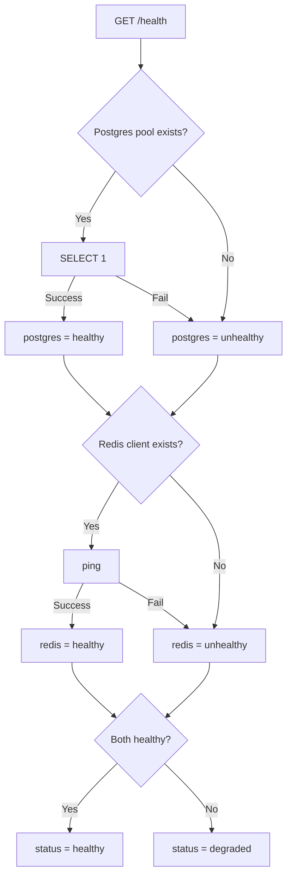

# backend/api/health.py

> **Source:** `backend/api/health.py`  
> **Purpose:** Health check endpoint for monitoring backend and its database dependencies.

---

## Imports

| Import | Library | Why used |
|--------|---------|----------|
| `APIRouter` | `fastapi` | Route registration |
| `postgres_db` | `db.postgres` | PostgreSQL pool |
| `redis_cache` | `db.redis` | Redis client |

---

## Router: `router = APIRouter()`

Mounted at `/health` in `main.py` (no prefix).

---

## Function: `health_check()` — GET `/health`

**Parameters:** None  
**Returns:**

```json
{
  "status": "healthy" | "degraded",
  "version": "1.0.0",
  "dependencies": {
    "postgres": "healthy" | "unhealthy",
    "redis": "healthy" | "unhealthy"
  }
}
```

**Logic flow:**



**Note:** MCP servers are **not** checked here. A degraded backend may still serve chat if MCP servers are reachable at call time.

---

## MCP connection

No direct MCP interaction. Health checks only Postgres and Redis — the data stores used alongside MCP tool calls for conversation history and caching.

---

## MCP novice notes

In production, you might add MCP server health probes (e.g. call `list_tools` on each server) to this endpoint for fuller observability.
