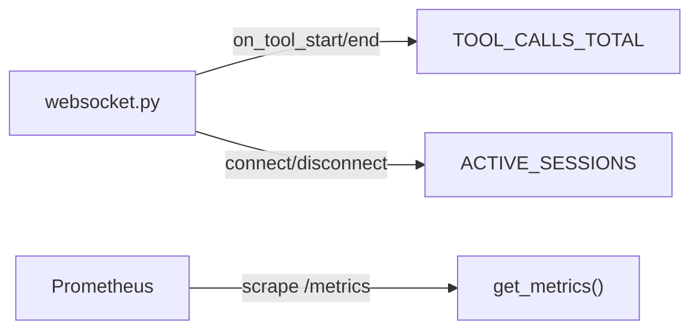

# backend/api/metrics.py

> **Source:** `backend/api/metrics.py`  
> **Purpose:** Exposes Prometheus metrics at `/metrics` for monitoring MCP tool usage and WebSocket sessions.

---

## Imports

| Import | Library | Why used |
|--------|---------|----------|
| `APIRouter, Response` | `fastapi` | Route + raw response |
| `Counter, Histogram, Gauge, generate_latest, CONTENT_TYPE_LATEST` | `prometheus_client` | Metric types and exposition format |

---

## Metrics defined

### `TOOL_CALLS_TOTAL` — Counter

| Label | Values | When incremented |
|-------|--------|------------------|
| `tool_name` | e.g. `search_orders_v1` | WebSocket `on_tool_start` / `on_tool_end` |
| `tenant_id` | `tenant_a`, `tenant_b` | Per chat session |
| `status` | `started`, `success` | Tool lifecycle |

### `TOOL_FAILURES_TOTAL` — Counter

| Label | Description |
|-------|-------------|
| `tool_name` | Which MCP tool failed |
| `error_type` | Error category |

*(Defined but incremented elsewhere when failures are tracked)*

### `TOOL_LATENCY_SECONDS` — Histogram

| Label | Buckets |
|-------|---------|
| `tool_name` | 0.05, 0.1, 0.25, 0.5, 1.0, 2.5, 5.0, 10.0 seconds |

### `ACTIVE_SESSIONS` — Gauge

Tracks open WebSocket connections. Incremented on connect, decremented on disconnect in `api/websocket.py`.

---

## Function: `get_metrics()` — GET `/metrics`

**Parameters:** None  
**Returns:** Prometheus text exposition format (`Content-Type: text/plain`)

**Logic:** Calls `generate_latest()` to serialize all registered metrics.

---

## MCP connection

Metrics track **MCP tool invocations** as observed by the LangGraph streaming layer — each tool name corresponds to an MCP tool exposed by one of the three servers.

---

## MCP novice notes

Prometheus metrics give you aggregate visibility: "How many `refund_order_v1` calls happened for `tenant_a` today?" without reading individual MCP server logs.
