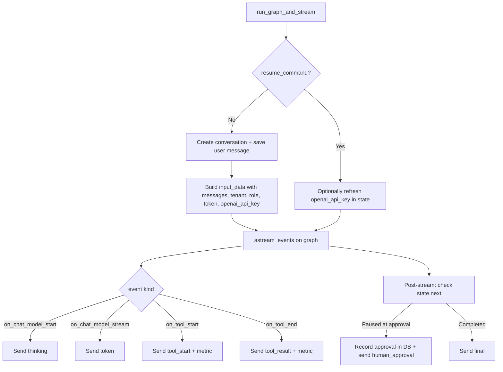
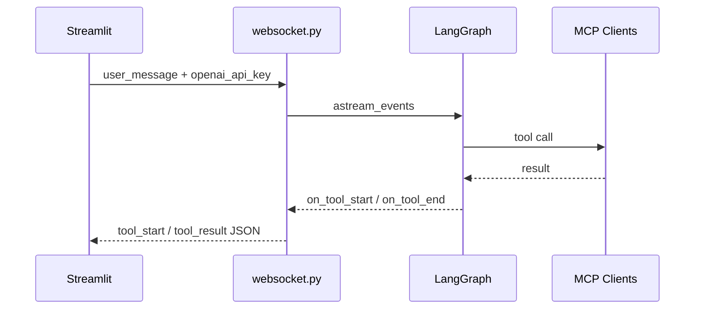

# backend/api/websocket.py

> **Source:** `backend/api/websocket.py`  
> **Purpose:** Real-time chat over WebSocket — runs the LangGraph agent, streams LLM tokens and MCP tool events, and handles human-in-the-loop approval.

---

## Imports

| Import | Library | Why used |
|--------|---------|----------|
| `json` | stdlib | Parse incoming WebSocket messages |
| `logging` | stdlib | Session and error logging |
| `asyncio` | stdlib | Background graph execution tasks |
| `WebSocket, WebSocketDisconnect` | `fastapi` | WebSocket endpoint |
| `WebSocketState` | `starlette.websockets` | Check connection status during streaming |
| `HumanMessage` | `langchain_core.messages` | Wrap user input for LangGraph |
| `Command` | `langgraph.types` | Resume paused graph on approval |
| `decode_token` | `auth.jwt_handler` | Validate JWT from query param |
| `graph_builder` | `graph.builder` | Compiled LangGraph |
| `postgres_db` | `db.postgres` | Save messages, record approvals |
| `ACTIVE_SESSIONS, TOOL_CALLS_TOTAL, ...` | `api.metrics` | Prometheus metrics |

---

## Function: `run_graph_and_stream(...)`

**Parameters:**

| Param | Type | Description |
|-------|------|-------------|
| `websocket` | `WebSocket` | Active connection for outbound events |
| `thread_id` | `str` | LangGraph checkpoint thread |
| `tenant_id` | `str` | Tenant from JWT |
| `user_id` | `str` | User from JWT |
| `role` | `str` | Role from JWT |
| `token` | `str` | JWT string (forwarded to Orders MCP tools) |
| `content` | `str \| None` | User message text (new runs only) |
| `resume_command` | `Command \| None` | Resume payload (approval flows) |
| `openai_api_key` | `str \| None` | Per-session OpenAI key from UI |

**Returns:** None (streams events over WebSocket)

**Logic flow:**

### WebSocket event types sent to client

| `type` | When | Payload |
|--------|------|---------|
| `thinking` | LLM starts generating | `{content: "Analyzing request..."}` |
| `token` | LLM streams a token | `{content: "<token>"}` |
| `tool_start` | MCP tool begins | `{tool_name, input}` |
| `tool_result` | MCP tool completes | `{tool_name, output}` |
| `human_approval` | Refund > $1000 paused | `{thread_id, data: {tool_name, order_id, amount, reason}}` |
| `final` | Agent finished | `{content: "<final answer>"}` |
| `error` | Exception | `{message}` |

---

## Function: `websocket_chat_endpoint(websocket)` — WS `/ws/chat`

**Parameters:** `websocket` — incoming connection; JWT in `?token=...` query param  
**Returns:** None (long-lived connection)

**Authentication flow:**
1. Read `token` from query params
2. `decode_token(token)` → extract `user_id`, `tenant_id`, `role`
3. Reject with close code `4008` if missing/invalid

**Message loop** — expects JSON with `type` and `thread_id`:

| Incoming `type` | Action |
|-----------------|--------|
| `user_message` | `asyncio.create_task(run_graph_and_stream(...))` with `content` and `openai_api_key` |
| `approval_response` | Update DB + resume graph with `Command(resume=...)` |
| `ping` | Reply `{"type": "pong"}` |

---

## MCP connection

Tool events (`tool_start`, `tool_result`) are emitted when LangGraph executes tools in `graph/tools.py`, which call MCP clients. The WebSocket layer is the **observability bridge** between MCP tool execution and the Streamlit UI.

---

## MCP novice notes

- `openai_api_key` travels **per WebSocket message**, not stored server-side — this lets users bring their own key via the Streamlit sidebar.
- `token` (JWT) is injected into graph state and forwarded to Orders MCP tools for authorization.
- Each `user_message` spawns a background `asyncio.create_task` so the WebSocket loop stays responsive.
