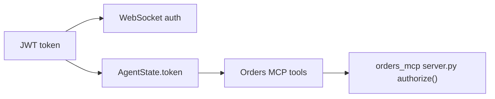

# backend/auth/jwt_handler.py

> **Source:** `backend/auth/jwt_handler.py`  
> **Purpose:** Create and validate JWT access tokens carrying user identity, tenant, and role for multi-tenant RBAC.

---

## Imports

| Import | Library | Why used |
|--------|---------|----------|
| `datetime, timedelta` | stdlib | Token expiration |
| `Dict, Optional` | `typing` | Type hints |
| `jwt, JWTError` | `jose` (python-jose) | JWT encode/decode |
| `WebSocket, WebSocketException, status` | `fastapi` | WebSocket auth helper |
| `settings` | `config` | `JWT_SECRET`, `JWT_ALGORITHM` |

---

## Function: `create_access_token(user_id, tenant_id, role, expires_delta=None) -> str`

**Parameters:**

| Param | Type | Default | Description |
|-------|------|---------|-------------|
| `user_id` | `str` | — | Unique user identifier |
| `tenant_id` | `str` | — | `tenant_a` or `tenant_b` |
| `role` | `str` | — | `admin`, `support`, or `viewer` |
| `expires_delta` | `timedelta \| None` | 24 hours | Custom expiration |

**Returns:** Signed JWT string

**Payload claims:**
```json
{"user_id": "...", "tenant_id": "...", "role": "...", "exp": <unix timestamp>}
```

**Logic:** Build payload → set expiration → `jwt.encode` with `HS256` and `settings.JWT_SECRET`.

---

## Function: `decode_token(token: str) -> Optional[Dict]`

**Parameters:** `token` — JWT string  
**Returns:** Decoded claims dict, or `None` if invalid/expired

**Logic:** `jwt.decode` with secret and algorithm → catch `JWTError` → return `None`.

---

## Function: `authenticate_websocket(websocket: WebSocket) -> Dict`

**Parameters:** `websocket` — FastAPI WebSocket connection  
**Returns:** Decoded JWT claims  
**Raises:** `WebSocketException` (closes connection) if auth fails

**Logic flow:**
1. Try `?token=` query parameter
2. Fallback: `Authorization: Bearer <token>` header
3. `decode_token` — close with `WS_1008_POLICY_VIOLATION` if invalid
4. Return claims

**Note:** `websocket.py` uses `decode_token` directly instead of this helper, but both approaches are equivalent.

---

## MCP connection



The JWT is **forwarded to the Orders MCP server** on every order tool call. The server decodes it independently (`mcp_servers/orders/auth.py`) to verify tenant and role permissions.

CRM and Tickets MCP servers do not require JWT in this demo.

---

## MCP novice notes

JWT provides **defense in depth**: the backend filters tools by role (`permissions.py`), and the Orders MCP server re-validates the token. Even if the LLM hallucinates a tool call, the MCP server can reject unauthorized access.
