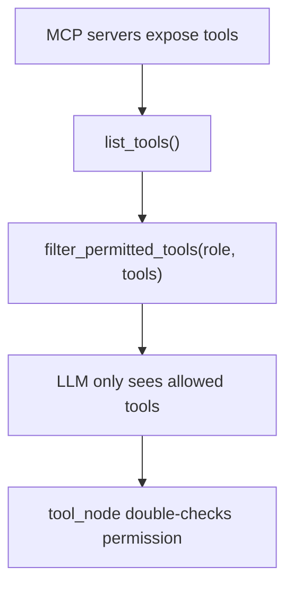

# backend/auth/permissions.py

> **Source:** `backend/auth/permissions.py`  
> **Purpose:** Role-based access control (RBAC) mapping — defines which MCP tools each role may invoke.

---

## Imports

| Import | Library | Why used |
|--------|---------|----------|
| `Set, Dict, List` | `typing` | Type hints for permission maps |

---

## Constant: `ROLE_PERMISSIONS`

Maps role names to sets of allowed tool names.

| Role | Allowed tools |
|------|---------------|
| **admin** | All 10 tools: `search_orders_v1`, `get_order_details_v1`, `refund_order_v1`, `cancel_order_v1`, `get_customer`, `update_customer`, `customer_notes`, `create_ticket`, `search_ticket`, `update_ticket` |
| **support** | Read orders + read customer + create/search tickets (no refunds, cancel, or customer updates) |
| **viewer** | Read-only: `search_orders_v1`, `get_order_details_v1`, `get_customer`, `search_ticket` |

---

## Function: `has_permission(role: str, tool_name: str) -> bool`

**Parameters:**
- `role` — user role from JWT
- `tool_name` — MCP tool name (e.g. `refund_order_v1`)

**Returns:** `True` if role may call the tool

**Logic:** Lookup `ROLE_PERMISSIONS[role]` → check membership.

---

## Function: `filter_permitted_tools(role: str, tools: List[dict]) -> List[dict]`

**Parameters:**
- `role` — user role
- `tools` — list of tool dicts with `"name"` key (from MCP `list_tools`)

**Returns:** Filtered list containing only permitted tools

**Logic:** List comprehension keeping tools whose `name` is in the role's allowed set.

---

## MCP connection

Used in:
- `graph/tools.py` → `get_tools_for_role()` — binds only allowed tools to the LLM
- `graph/nodes.py` → `tool_node` — blocks execution if tool not in role map

The Orders MCP server has its **own** permission map in `mcp_servers/orders/auth.py` (slightly different — support can `cancel_order_v1`).

---

## MCP novice notes

RBAC at the **agent layer** prevents the LLM from even seeing dangerous tools. RBAC at the **MCP server layer** (orders only) prevents direct API abuse. This two-layer model is a best practice for production MCP deployments.
