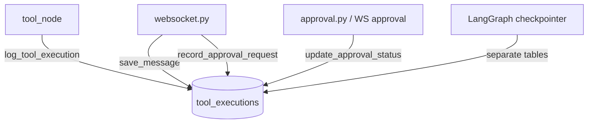

# backend/db/postgres.py

> **Source:** `backend/db/postgres.py`  
> **Purpose:** Async PostgreSQL connection pool and tenant-safe data access for conversations, messages, tool audit logs, and approvals.

---

## Imports

| Import | Library | Why used |
|--------|---------|----------|
| `json` | stdlib | Serialize metadata dicts |
| `logging` | stdlib | Connection and error logging |
| `List, Optional, Dict, Any` | `typing` | Type hints |
| `asyncpg` | `asyncpg` | High-performance async PostgreSQL driver |
| `settings` | `config` | `POSTGRES_URL` |

---

## Class: `PostgresManager`

### `__init__(self)`

Initializes `self.pool = None`.

---

### `connect(self) -> None`

**Returns:** Nothing (sets `self.pool`)

Creates an `asyncpg` pool: min 2, max 10 connections. Raises on failure.

---

### `close(self) -> None`

Closes the connection pool if open.

---

### `execute(query, *args) -> str`

**Returns:** Status string (e.g. `"INSERT 0 1"`)

Runs INSERT/UPDATE/DELETE without returning rows.

---

### `fetch(query, *args) -> List[asyncpg.Record]`

**Returns:** List of row records.

---

### `fetchrow(query, *args) -> Optional[asyncpg.Record]`

**Returns:** Single row or `None`.

---

### `fetchval(query, *args) -> Any`

**Returns:** Single scalar value (used by health check `SELECT 1`).

---

### `get_messages(conversation_id, tenant_id) -> List[Dict]`

**Returns:** Message dicts with `role`, `content`, `metadata`, `created_at`

Joins `messages` ↔ `conversations` with **tenant_id filter** for isolation.

---

### `save_message(conversation_id, tenant_id, role, content, metadata=None) -> None`

**Raises:** `ValueError` if conversation doesn't exist for tenant

Verifies tenant ownership before insert.

---

### `get_or_create_conversation(thread_id, user_id, tenant_id) -> str`

**Returns:** Conversation ID (e.g. `conv_thread_demo_1`)

**Logic:**
1. SELECT by `thread_id` + `tenant_id`
2. If missing, INSERT with `ON CONFLICT (thread_id) DO UPDATE`
3. Links LangGraph `thread_id` to a conversation record

---

### `log_tool_execution(conversation_id, tool_name, input_val, output_val, latency_ms, status) -> None`

Inserts into `tool_executions` — audit trail for every MCP tool call from `tool_node`.

---

### `record_approval_request(thread_id, tool_name, amount) -> int`

**Returns:** New approval row ID

Inserts `pending` approval when refund > $1,000 pauses the graph.

---

### `update_approval_status(thread_id, approved, reviewer_id) -> None`

Sets status to `approved` or `denied`, records `reviewer_id` and `resolved_at`.

---

## Singleton: `postgres_db = PostgresManager()`

---

## MCP connection

Postgres stores **what happened** when MCP tools ran (audit), not the MCP server's order/customer data.

---

## MCP novice notes

Multi-tenant safety: every query includes `tenant_id` to prevent cross-tenant data leaks. MCP servers enforce tenant isolation separately in their mock databases.
