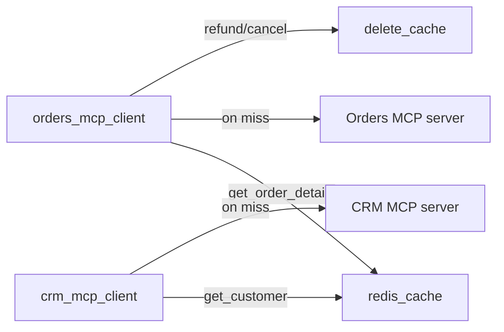

# backend/db/redis.py

> **Source:** `backend/db/redis.py`  
> **Purpose:** Async Redis client for caching MCP tool results (orders and customers) at the backend client layer.

---

## Imports

| Import | Library | Why used |
|--------|---------|----------|
| `json` | stdlib | JSON serialize/deserialize cached values |
| `logging` | stdlib | Error logging |
| `Optional, Any` | `typing` | Type hints |
| `redis.asyncio as aioredis` | `redis` | Async Redis client |
| `settings` | `config` | `REDIS_URL` |

---

## Class: `RedisManager`

### `connect(self) -> None`

Creates client via `aioredis.from_url(settings.REDIS_URL, decode_responses=True)`. Pings to verify. Sets `self.client = None` on failure (graceful degradation).

---

### `close(self) -> None`

Closes Redis connection.

---

### `get_cache(key: str) -> Optional[Any]`

**Parameters:** `key` — cache key string  
**Returns:** Parsed JSON object, or `None` on miss/error

---

### `set_cache(key: str, value: Any, ttl: int = 300) -> bool`

**Parameters:**
- `key` — cache key
- `value` — any JSON-serializable object
- `ttl` — time-to-live in seconds (default 5 minutes)

**Returns:** `True` on success, `False` if Redis unavailable

Uses `SETEX` for automatic expiration.

---

### `delete_cache(key: str) -> bool`

**Returns:** `True` if key deleted

Called after mutating operations (refund, cancel, update customer) to invalidate stale cache.

---

## Singleton: `redis_cache = RedisManager()`

---

## MCP connection

Cache key patterns:
- `order_cache:{tenant_id}:{order_id}`
- `customer_cache:{tenant_id}:{customer_id}`

The Orders MCP server **also** caches at the server layer — this is intentional demo redundancy showing cache-at-client and cache-at-server patterns.

---

## MCP novice notes

Caching MCP responses reduces latency and load on MCP servers. TTL of 300 seconds means data may be briefly stale — acceptable for a demo, but production would need cache invalidation on writes (partially implemented via `delete_cache`).
