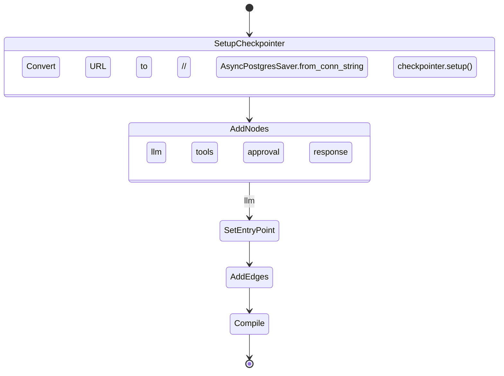
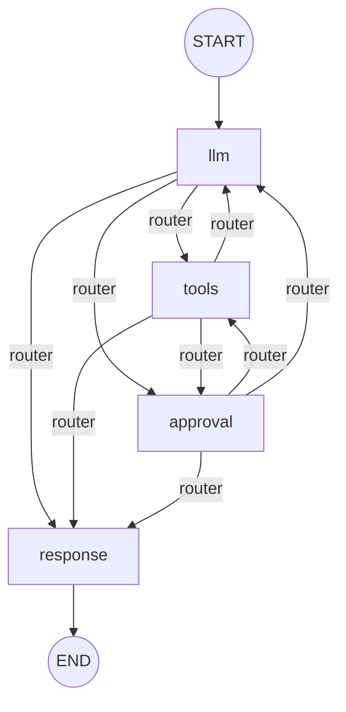

# backend/graph/builder.py

> **Source:** `backend/graph/builder.py`  
> **Purpose:** Constructs and compiles the LangGraph StateGraph with PostgreSQL checkpointing for durable, resumable agent sessions.

---

## Imports

| Import | Library | Why used |
|--------|---------|----------|
| `logging` | stdlib | Setup logging |
| `StateGraph, START, END` | `langgraph.graph` | Graph construction primitives |
| `AsyncPostgresSaver` | `langgraph.checkpoint.postgres.aio` | Persist graph state to PostgreSQL |
| `settings` | `config` | Database URL |
| `AgentState` | `graph.state` | State schema |
| `llm_node, tool_node, approval_node, response_node, router_node` | `graph.nodes` | Node implementations |

---

## Class: `GraphBuilder`

### `initialize(self) -> None`

**Logic flow:**

**Graph structure:**

**Conditional edges** use `router_node` to decide the next step based on message types and `approval_required` flag.

**Compile:** `workflow.compile(checkpointer=self.checkpointer)`

---

### `cleanup(self) -> None`

Placeholder for checkpointer connection cleanup.

---

## Singleton: `graph_builder = GraphBuilder()`

Initialized during FastAPI lifespan in `main.py`.

---

## MCP connection

The graph itself doesn't call MCP — it orchestrates nodes that do:

| Node | MCP interaction |
|------|-----------------|
| `llm_node` | Binds MCP-backed tools to LLM |
| `tool_node` | Executes MCP tools via clients |
| `approval_node` | Pauses before MCP refund executes |
| `response_node` | No MCP |

**Checkpointing** means a paused approval survives server restarts — the state including `pending_approval` is in PostgreSQL.

---

## MCP novice notes

LangGraph turns a linear "call LLM → call tool → call LLM" pattern into an explicit **graph** with:
- **Conditional routing** (tools vs response vs approval)
- **Interrupts** (human-in-the-loop)
- **Persistence** (checkpoint to Postgres)

This is more robust than a simple while-loop agent for production MCP applications.
