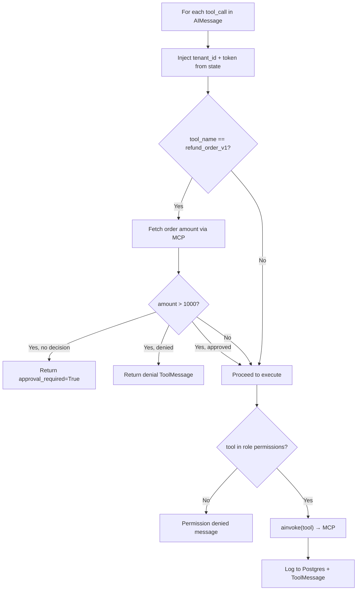

# backend/graph/nodes.py

> **Source:** `backend/graph/nodes.py`  
> **Purpose:** LangGraph node functions — LLM reasoning, MCP tool execution, human approval interrupt, and final response formatting.

---

## Imports

| Import | Library | Why used |
|--------|---------|----------|
| `json, logging, time` | stdlib | Serialization, logging, latency measurement |
| `Dict, Any, List` | `typing` | Type hints |
| `ChatOpenAI` | `langchain_openai` | OpenAI GPT-4o with streaming |
| `AIMessage, ToolMessage, HumanMessage` | `langchain_core.messages` | Message types |
| `interrupt` | `langgraph.types` | Pause graph for human approval |
| `AgentState` | `graph.state` | State schema |
| `get_tools_for_role` | `graph.tools` | Role-filtered tools |
| `postgres_db` | `db.postgres` | Audit logging |
| `settings` | `config` | Fallback OpenAI key |

---

## Function: `_get_llm(api_key=None) -> ChatOpenAI`

**Returns:** `ChatOpenAI` configured for `gpt-4o`, temperature 0, streaming enabled

**Key resolution:** `api_key` (from state) → `settings.OPENAI_API_KEY` → raise `ValueError`

---

## Node: `llm_node(state) -> Dict`

**Purpose:** Call GPT-4o with role-filtered tools bound.

**Logic flow:**
1. Get messages and role from state
2. `get_tools_for_role(role)` → bind to LLM
3. `_get_llm(state["openai_api_key"])` → `ainvoke(messages)`
4. Return `{"messages": [response], "current_step": "llm"}`

On missing API key → return error AIMessage with `final_answer`.

---

## Node: `tool_node(state) -> Dict`

**Purpose:** Execute LLM's tool calls via MCP clients.

**Logic flow per tool call:**

**Returns:** `{"messages": [ToolMessage, ...], "current_step": "tools_executed"}` or approval state update.

---

## Node: `approval_node(state) -> Dict`

**Purpose:** Human-in-the-loop interrupt for refunds > $1,000.

**Logic flow:**
1. Read `pending_approval` from state
2. Call `interrupt({type: "approval_request", ...})` — **graph pauses here**
3. On resume via `Command(resume={approved, reviewer_id})`:
   - Set `pending["status"]` to `approved` or `denied`
4. Return updated state

---

## Node: `response_node(state) -> Dict`

**Purpose:** Save final assistant message to Postgres and set `final_answer`.

---

## Router: `router_node(state) -> str`

**Returns:** Next node name: `"llm"`, `"tools"`, `"approval"`, or `"response"`

| Condition | Route to |
|-----------|----------|
| Last message is AIMessage with tool_calls + `approval_required` | `"approval"` |
| Last message is AIMessage with tool_calls | `"tools"` |
| Last message is ToolMessage | `"llm"` |
| Otherwise (final AI response) | `"response"` |

---

## MCP connection

`tool_node` is where MCP tools actually execute:
- Injects `tenant_id` and `token` from state (LLM doesn't supply these)
- Calls `orders_mcp_client.get_order_details` to check refund amount **before** MCP refund
- Executes tools via `target_tool.ainvoke()` → `graph/tools.py` → MCP clients

---

## MCP novice notes

The **$1,000 refund gate** happens in `tool_node`, not the MCP server. The server logs that approval is needed but still processes if called. The LangGraph layer is the enforcement point — demonstrating human-in-the-loop at the **agent orchestration** layer.
