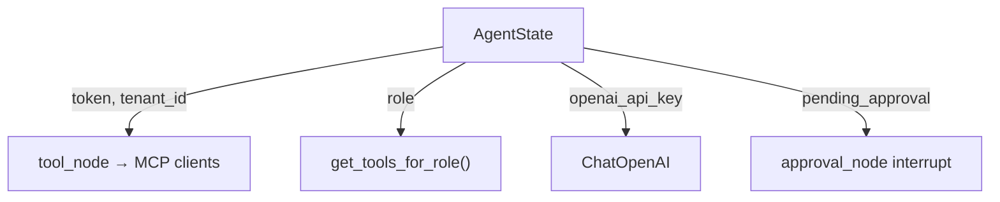

# backend/graph/state.py

> **Source:** `backend/graph/state.py`  
> **Purpose:** Defines the LangGraph agent state schema — the shared data structure passed between graph nodes.

---

## Imports

| Import | Library | Why used |
|--------|---------|----------|
| `TypedDict, Annotated, Sequence, Optional, List, Dict, Any` | `typing` | State type definition |
| `add_messages` | `langgraph.graph.message` | Reducer that appends messages instead of overwriting |
| `BaseMessage` | `langchain_core.messages` | LangChain message types (Human, AI, Tool) |

---

## Class: `AgentState(TypedDict)`

| Field | Type | Description |
|-------|------|-------------|
| `messages` | `Annotated[Sequence[BaseMessage], add_messages]` | Conversation history — **appended** via reducer |
| `user_id` | `str` | Current user |
| `tenant_id` | `str` | Multi-tenant scope (`tenant_a`, `tenant_b`) |
| `role` | `str` | RBAC role (`admin`, `support`, `viewer`) |
| `token` | `str` | JWT forwarded to Orders MCP tools |
| `openai_api_key` | `Optional[str]` | Per-session key from Streamlit sidebar |
| `tool_calls` | `Optional[List[Dict]]` | *(reserved — not actively used)* |
| `tool_results` | `Optional[List[Dict]]` | *(reserved)* |
| `approval_required` | `bool` | `True` when refund > $1000 needs human OK |
| `current_step` | `str` | Debug label for current node |
| `final_answer` | `Optional[str]` | Agent's final response text |
| `conversation_id` | `str` | PostgreSQL conversation ID |
| `pending_approval` | `Optional[Dict]` | Refund details while paused |

### `pending_approval` structure (when set)

```python
{
    "tool_name": "refund_order_v1",
    "order_id": "ord_102",
    "amount": 1200.0,
    "reason": "...",
    "status": "pending" | "approved" | "denied",
    "tool_call_id": "...",
    "tool_args": {...},
    "reviewer_id": "..."  # after decision
}
```

---

## MCP connection



State is **checkpointed** to PostgreSQL by LangGraph — when a refund pauses for approval, the entire state (including `pending_approval`) is persisted and can be resumed hours later.

---

## MCP novice notes

- `add_messages` reducer means each node returns `{"messages": [new_msg]}` and LangGraph **appends** rather than replaces.
- `token` in state is how the JWT reaches MCP tools without the LLM needing to know about authentication.
- `openai_api_key` enables BYOK (bring your own key) from the Streamlit UI.
