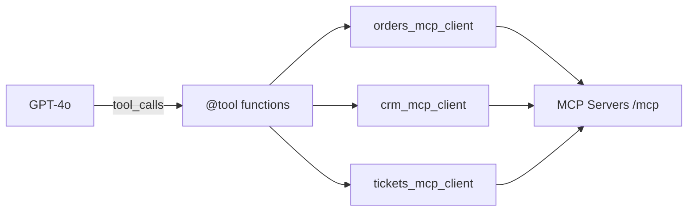

# backend/graph/tools.py

> **Source:** `backend/graph/tools.py`  
> **Purpose:** LangChain tool definitions that bridge the LLM to MCP clients — the adapter layer between AI and MCP.

---

## Imports

| Import | Library | Why used |
|--------|---------|----------|
| `json` | stdlib | Serialize MCP responses as JSON strings for LLM |
| `logging` | stdlib | Logging |
| `Optional, Dict, Any, List` | `typing` | Type hints |
| `tool` | `langchain_core.tools` | Decorator to register callable tools |
| `orders_mcp_client, crm_mcp_client, tickets_mcp_client` | `mcp_clients.*` | Domain MCP clients |

---

## Tools defined

Each `@tool` async function returns a **JSON string** (LLMs work best with text).

### Orders (via `orders_mcp_client`)

| Tool name | Parameters | MCP tool called |
|-----------|------------|-----------------|
| `search_orders_v1` | `tenant_id`, `token`, `user_id?` | `search_orders_v1` |
| `get_order_details_v1` | `tenant_id`, `token`, `order_id` | `get_order_details_v1` |
| `refund_order_v1` | `tenant_id`, `token`, `order_id`, `reason` | `refund_order_v1` |
| `cancel_order_v1` | `tenant_id`, `token`, `order_id`, `reason` | `cancel_order_v1` |

### CRM (via `crm_mcp_client`)

| Tool name | Parameters | MCP tool called |
|-----------|------------|-----------------|
| `get_customer` | `tenant_id`, `customer_id` | `get_customer` |
| `update_customer` | `tenant_id`, `customer_id`, `email?`, `phone?` | `update_customer` |
| `customer_notes` | `tenant_id`, `customer_id`, `note` | `customer_notes` |

### Tickets (via `tickets_mcp_client`)

| Tool name | Parameters | MCP tool called |
|-----------|------------|-----------------|
| `create_ticket` | `tenant_id`, `customer_id`, `subject`, `priority` | `create_ticket` |
| `search_ticket` | `tenant_id`, `customer_id?` | `search_ticket` |
| `update_ticket` | `tenant_id`, `ticket_id`, `status?`, `priority?` | `update_ticket` |

---

## Constant: `ALL_TOOLS`

List of all 10 tool functions.

---

## Function: `get_tools_for_role(role: str) -> List`

**Parameters:** `role` — JWT role  
**Returns:** Filtered list of `@tool` functions allowed for that role

Imports `ROLE_PERMISSIONS` from `auth.permissions` and filters `ALL_TOOLS` by name.

---

## MCP connection

This is the **LLM ↔ MCP bridge**:
1. LLM sees tool schemas (name, description, parameters)
2. LLM emits `tool_calls` with arguments
3. `tool_node` executes these functions
4. Functions call MCP clients → MCP servers

---

## MCP novice notes

- Tool names must **match exactly** between LangChain tools, MCP server tools, and `permissions.py`.
- The `@tool` decorator auto-generates JSON schemas the LLM uses to decide when/how to call tools.
- `langchain-mcp-adapters` is in requirements but this repo uses **manual** tool wrappers — a valid pattern when you need custom caching, auth injection, or approval logic.
