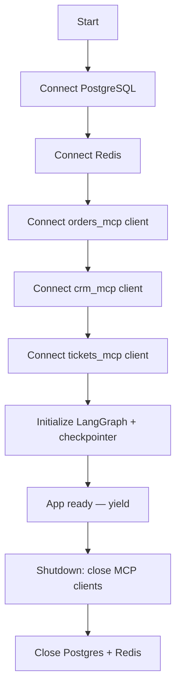

# backend/main.py

> **Source:** `backend/main.py`  
> **Purpose:** Application entry point — creates the FastAPI app, wires up routers, manages startup/shutdown of databases, MCP clients, and the LangGraph engine.

---

## Imports

| Import | Library | Why used |
|--------|---------|----------|
| `logging` | stdlib | Structured log output |
| `asynccontextmanager` | stdlib | FastAPI lifespan hook |
| `FastAPI, Depends, HTTPException` | `fastapi` | Web framework |
| `CORSMiddleware` | `fastapi.middleware.cors` | Allow cross-origin requests (Streamlit → backend) |
| `BaseModel` | `pydantic` | Request body validation for `/api/token` |
| `settings` | `config` | Environment configuration |
| `setup_logging` | `logging_config` | JSON log formatter |
| `postgres_db` | `db.postgres` | PostgreSQL connection pool |
| `redis_cache` | `db.redis` | Redis client |
| `orders_mcp_client, crm_mcp_client, tickets_mcp_client` | `mcp_clients.*` | MCP client singletons |
| `graph_builder` | `graph.builder` | Compiled LangGraph workflow |
| `create_access_token` | `auth.jwt_handler` | Demo JWT generation |
| `health_router, metrics_router, approval_router, ws_router` | `api.*` | HTTP/WebSocket route modules |
| `uvicorn` | `uvicorn` | ASGI server (when run directly) |

---

## Functions & classes

### `lifespan(app: FastAPI)` — async context manager

**Parameters:** `app` — the FastAPI application instance  
**Returns:** Yields control during app runtime; cleanup runs on shutdown

**Startup logic flow:**

- MCP client connections are wrapped in `try/except` — if a server is offline, the app still starts (errors are logged).
- `graph_builder.initialize()` compiles the LangGraph agent with a PostgreSQL checkpointer.

**Shutdown:** Closes all MCP sessions, then database connections.

---

### `TokenRequest` (Pydantic model)

| Field | Type | Description |
|-------|------|-------------|
| `user_id` | `str` | Demo user ID |
| `tenant_id` | `str` | `tenant_a` or `tenant_b` |
| `role` | `str` | `admin`, `support`, or `viewer` |

---

### `generate_token_for_demo(req: TokenRequest)` — POST `/api/token`

**Parameters:** `req` — user/tenant/role for the JWT  
**Returns:** `{"access_token": "<jwt>", "token_type": "bearer"}`  
**Raises:** HTTP 500 on failure

Used by the Streamlit frontend to obtain a JWT before opening a WebSocket.

---

### `app` — FastAPI instance

- Title: "Production Customer Support Agent API"
- CORS: allows all origins (`*`) for demo convenience
- Routers mounted:
  - `/health` — health check
  - `/metrics` — Prometheus
  - `/api/human-approval` — REST approval endpoint
  - `/ws/chat` — WebSocket chat

---

## MCP connection

On startup, three MCP clients connect via `streamable_http_client` to:

- `http://orders_mcp:8001/mcp`
- `http://crm_mcp:8002/mcp`
- `http://tickets_mcp:8003/mcp`

These clients are used later by LangGraph tools (`graph/tools.py`) when the LLM decides to call a tool.

---

## MCP novice notes

`main.py` is the **orchestrator** — it doesn't call MCP tools itself. It ensures MCP clients are connected before any chat request arrives, so tool calls don't fail with "client not connected."
