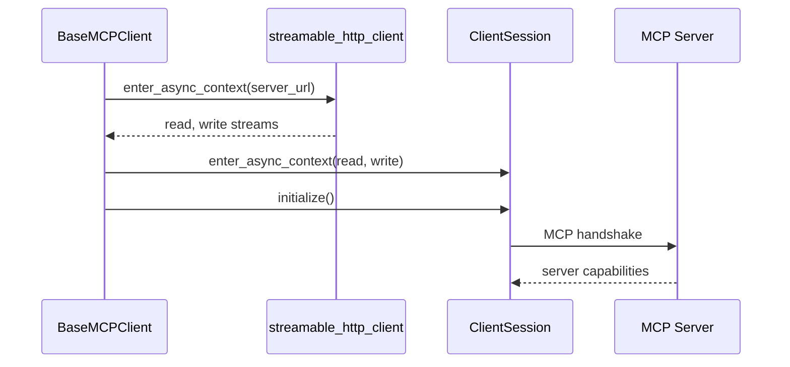
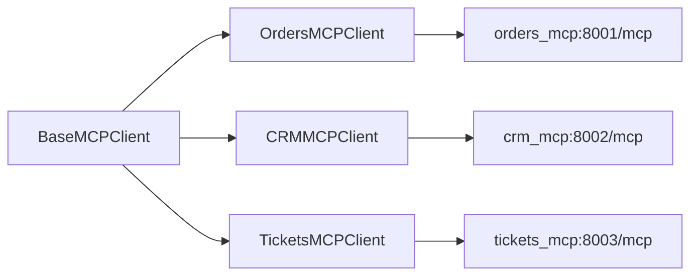

# backend/mcp_clients/base.py

> **Source:** `backend/mcp_clients/base.py`  
> **Purpose:** Base MCP client class — connects to MCP servers via Streamable HTTP, lists tools, and calls tools with retry logic.

---

## Imports

| Import | Library | Why used |
|--------|---------|----------|
| `asyncio` | stdlib | Sleep between retries |
| `logging` | stdlib | Connection and call logging |
| `Dict, List, Optional, Any` | `typing` | Type hints |
| `AsyncExitStack` | `contextlib` | Manage async context lifetimes |
| `ClientSession` | `mcp` | MCP client session (initialize, list_tools, call_tool) |
| `streamable_http_client` | `mcp.client.streamable_http` | **Streamable HTTP transport** to `/mcp` endpoint |

---

## Class: `BaseMCPClient`

### `__init__(self, server_url: str, server_name: str)`

| Attribute | Description |
|-----------|-------------|
| `server_url` | Full URL including `/mcp` (e.g. `http://orders_mcp:8001/mcp`) |
| `server_name` | Human-readable label for logs |
| `session` | `ClientSession` after connect |
| `_exit_stack` | Manages transport + session cleanup |

---

### `connect(self) -> None`

**Logic flow:**



On failure: logs error, calls `close()`, re-raises.

---

### `close(self) -> None`

Closes `_exit_stack`, sets `session = None`.

---

### `list_tools(self) -> List[Dict[str, Any]]`

**Returns:** List of `{"name", "description", "inputSchema"}` dicts

Calls `session.list_tools()` → converts MCP `Tool` objects to plain dicts.

---

### `call_tool_with_retry(self, tool_name, arguments, max_attempts=3) -> Dict`

**Parameters:**

| Param | Type | Description |
|-------|------|-------------|
| `tool_name` | `str` | MCP tool name |
| `arguments` | `Dict[str, Any]` | Tool input parameters |
| `max_attempts` | `int` | Max retry count (default 3) |

**Returns:**

```python
# Success
{"status": "success", "content": "<text from MCP response>"}

# Error
{"status": "error", "error_type": "permission_denied|timeout|fatal", "message": "..."}
```

**Logic flow:**

1. Call `session.call_tool(tool_name, arguments)`
2. Extract text from `result.content` list
3. If response contains `permission_denied` → return error, **no retry**
4. On `TimeoutError` or `ConnectionError` → exponential backoff retry (0.5s, 1s, 2s)
5. On other exceptions → return fatal error, no retry

---

## MCP connection (core concept)

This file is the **heart of MCP client integration** in this repo:

| MCP concept | Implementation |
|-------------|----------------|
| Transport | `streamable_http_client(url)` → HTTP to `/mcp` |
| Session | `ClientSession(read, write)` → protocol handshake |
| Tool discovery | `list_tools()` |
| Tool invocation | `call_tool(name, args)` |



---

## MCP novice notes

- **Streamable HTTP** is one of several MCP transports (others include stdio and SSE). This repo chose HTTP so servers can run as independent Docker containers.
- `AsyncExitStack` ensures transport and session are properly closed even if connection fails mid-setup.
- Retries only happen for **transient network errors**, not permission or validation failures — this prevents hammering MCP servers with doomed requests.
