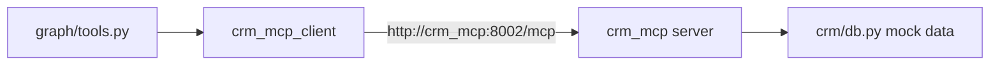

# backend/mcp_clients/crm.py

> **Source:** `backend/mcp_clients/crm.py`  
> **Purpose:** MCP client for the CRM server — customer lookup, updates, and notes with Redis caching.

---

## Imports

| Import | Library | Why used |
|--------|---------|----------|
| `json` | stdlib | Parse MCP JSON responses |
| `logging` | stdlib | Logging |
| `Dict, Any, Optional` | `typing` | Type hints |
| `BaseMCPClient` | `mcp_clients.base` | MCP connection base |
| `redis_cache` | `db.redis` | Customer data caching |
| `settings` | `config` | `CRM_MCP_URL` |

---

## Class: `CRMMCPClient(BaseMCPClient)`

### `__init__(self)`

`super().__init__(settings.CRM_MCP_URL, "crm_mcp")`

---

### `get_customer(tenant_id, customer_id) -> Dict`

**Logic:** Redis cache check → `get_customer` tool → cache 300s on success.

Cache key: `customer_cache:{tenant_id}:{customer_id}`

---

### `update_customer(tenant_id, customer_id, email=None, phone=None) -> Dict`

Invalidates cache → calls `update_customer` with optional email/phone.

---

### `customer_notes(tenant_id, customer_id, note) -> Dict`

Invalidates cache → calls `customer_notes` to append a note.

---

## Singleton: `crm_mcp_client = CRMMCPClient()`

---

## MCP tools mapped

| Client method | MCP tool | Auth required? |
|---------------|----------|----------------|
| `get_customer` | `get_customer` | No (tenant_id only) |
| `update_customer` | `update_customer` | No |
| `customer_notes` | `customer_notes` | No |

---

## MCP connection

---

## MCP novice notes

CRM tools don't require JWT — authorization is enforced only at the LangGraph layer via `permissions.py`. In production, you'd add JWT validation to the CRM MCP server too.
