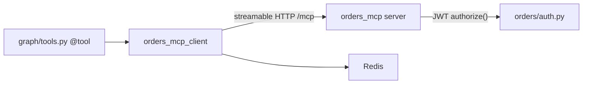

# backend/mcp_clients/orders.py

> **Source:** `backend/mcp_clients/orders.py`  
> **Purpose:** MCP client for the Orders server — wraps order tools with Redis caching and cache invalidation.

---

## Imports

| Import | Library | Why used |
|--------|---------|----------|
| `json` | stdlib | Parse MCP JSON responses |
| `logging` | stdlib | Cache hit/miss logging |
| `Dict, Any, Optional` | `typing` | Type hints |
| `BaseMCPClient` | `mcp_clients.base` | Connection and `call_tool_with_retry` |
| `redis_cache` | `db.redis` | Backend-side caching |
| `settings` | `config` | `ORDERS_MCP_URL` |

---

## Class: `OrdersMCPClient(BaseMCPClient)`

### `__init__(self)`

Calls `super().__init__(settings.ORDERS_MCP_URL, "orders_mcp")`.

---

### `get_order_details(tenant_id, token, order_id) -> Dict`

**Parameters:** tenant ID, JWT token, order ID  
**Returns:** Order dict (parsed JSON) or error dict

**Logic:**
1. Check Redis `order_cache:{tenant_id}:{order_id}`
2. On hit → return cached data
3. On miss → `call_tool_with_retry("get_order_details_v1", args)`
4. On success → parse JSON, cache for 300s, return

---

### `search_orders(tenant_id, token, user_id=None) -> Dict`

**Returns:** List of orders as parsed JSON

Calls `search_orders_v1` — no caching (search results may change).

---

### `refund_order(tenant_id, token, order_id, reason) -> Dict`

**Returns:** Refund result dict

**Logic:** `delete_cache` → call `refund_order_v1` → parse response.

---

### `cancel_order(tenant_id, token, order_id, reason) -> Dict`

Same pattern as refund — invalidate cache, call `cancel_order_v1`.

---

## Singleton: `orders_mcp_client = OrdersMCPClient()`

---

## MCP tools mapped

| Client method | MCP tool name | Server file |
|---------------|---------------|-------------|
| `search_orders` | `search_orders_v1` | `mcp_servers/orders/server.py` |
| `get_order_details` | `get_order_details_v1` | same |
| `refund_order` | `refund_order_v1` | same |
| `cancel_order` | `cancel_order_v1` | same |

---

## MCP connection

Every order tool requires `tenant_id` and `token` — the JWT is validated by the MCP server.

---

## MCP novice notes

This is a **domain-specific MCP client** — it knows about orders, caching, and the `_v1` tool naming convention. The base class handles protocol details; this class handles business logic.
