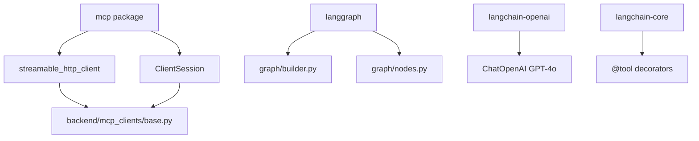

# backend/requirements.txt

> **Source:** `backend/requirements.txt`  
> **Purpose:** Python package dependencies for the FastAPI backend, LangGraph agent, and MCP clients.

---

## Dependencies explained

| Package | Version | Role in this repo |
|---------|---------|-------------------|
| `fastapi` | ≥0.110 | Web framework (REST + WebSocket) |
| `uvicorn[standard]` | ≥0.28 | ASGI server to run FastAPI |
| `pydantic` | ≥2.6 | Data validation (request/response models) |
| `pydantic-settings` | ≥2.2 | Environment-based configuration (`config.py`) |
| **`langgraph`** | ≥0.2 | **Agent workflow engine** — stateful graph with interrupts |
| **`langgraph-checkpoint-postgres`** | ≥2.0 | Persists LangGraph state to PostgreSQL |
| `psycopg[binary,pool]` | ≥3.1 | PostgreSQL driver for LangGraph checkpointer |
| `langchain-core` | ≥0.3 | Message types, tool decorators |
| `langchain-openai` | ≥0.2 | `ChatOpenAI` wrapper for GPT-4o |
| `langchain-mcp-adapters` | ≥0.1 | *(available for MCP-LangChain bridging; this repo uses custom clients)* |
| **`mcp`** | ≥1.0 | **Official MCP SDK** — `ClientSession`, `streamable_http_client` |
| `asyncpg` | ≥0.29 | Async PostgreSQL for app data (messages, approvals) |
| `redis[hiredis]` | ≥5.0 | Async Redis caching |
| `python-jose[cryptography]` | ≥3.3 | JWT encode/decode |
| `python-multipart` | ≥0.0.9 | Form data support for FastAPI |
| `structlog` | ≥24.1 | *(listed; logging uses custom JSON formatter)* |
| `opentelemetry-*` | various | Distributed tracing instrumentation |
| `prometheus-client` | ≥0.20 | `/metrics` endpoint |
| `SQLAlchemy` | ≥2.0 | ORM (available for future use) |
| `greenlet` | ≥3.0 | SQLAlchemy async support |
| `pytest`, `pytest-asyncio` | ≥8.0, ≥0.23 | Testing |
| `httpx` | ≥0.27 | HTTP client for tests |
| `websockets` | ≥12.0 | WebSocket protocol support |

---

## MCP-related packages (highlighted)

---

## MCP novice notes

- **`mcp`** is the critical package — it implements the client side of the Model Context Protocol over Streamable HTTP.
- **`langgraph`** orchestrates the agent loop: LLM → tools (MCP) → LLM → response, with pause/resume for human approval.
- MCP servers (`mcp_servers/`) have their own separate `requirements.txt` files with `fastmcp`.
