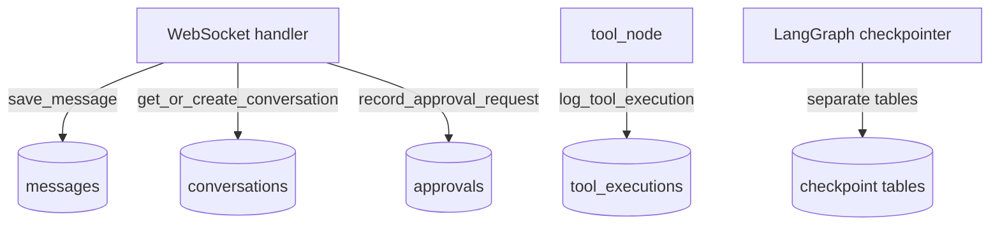

# db/init.sql

> **Source:** `db/init.sql`  
> **Purpose:** PostgreSQL schema initialization and seed data, run automatically when the `postgres` container starts for the first time.

---

## Tables

### `users`

Stores demo user accounts for multi-tenant authentication.

| Column | Type | Description |
|--------|------|-------------|
| `id` | VARCHAR(255) PK | Unique user ID (e.g. `user_admin_1`) |
| `email` | VARCHAR(255) | User email |
| `name` | VARCHAR(255) | Display name |
| `tenant_id` | VARCHAR(255) | Tenant isolation key (`tenant_a`, `tenant_b`) |
| `role` | VARCHAR(50) | JWT role: `admin`, `support`, or `viewer` |
| `created_at` | TIMESTAMP | Auto-set on insert |

### `conversations`

Maps LangGraph `thread_id` values to conversation records.

| Column | Type | Description |
|--------|------|-------------|
| `id` | VARCHAR(255) PK | Conversation ID (e.g. `conv_thread_demo_1`) |
| `user_id` | VARCHAR(255) FK → users | Owner |
| `tenant_id` | VARCHAR(255) | Tenant scope |
| `thread_id` | VARCHAR(255) UNIQUE | LangGraph checkpoint thread ID |
| `created_at` / `updated_at` | TIMESTAMP | Timestamps |

### `messages`

Chat history persisted by the backend WebSocket handler.

| Column | Type | Description |
|--------|------|-------------|
| `id` | SERIAL PK | Auto-increment |
| `conversation_id` | VARCHAR(255) FK | Parent conversation |
| `role` | VARCHAR(50) | `user` or `assistant` |
| `content` | TEXT | Message body |
| `metadata` | JSONB | Optional structured data |
| `created_at` | TIMESTAMP | When saved |

### `tool_executions`

Audit log for every MCP tool call made by the agent.

| Column | Type | Description |
|--------|------|-------------|
| `id` | SERIAL PK | Auto-increment |
| `conversation_id` | VARCHAR(255) FK | Related conversation |
| `tool_name` | VARCHAR(255) | e.g. `search_orders_v1` |
| `input` | TEXT | Tool arguments (JSON string) |
| `output` | TEXT | Tool result |
| `latency_ms` | INTEGER | Execution time |
| `status` | VARCHAR(50) | `success`, `error`, `permission_denied` |
| `created_at` | TIMESTAMP | When logged |

### `approvals`

Human-in-the-loop records for high-value refunds (> $1,000).

| Column | Type | Description |
|--------|------|-------------|
| `id` | SERIAL PK | Auto-increment |
| `thread_id` | VARCHAR(255) | LangGraph thread paused for approval |
| `tool_name` | VARCHAR(255) | Usually `refund_order_v1` |
| `amount` | NUMERIC(10,2) | Refund amount |
| `status` | VARCHAR(50) | `pending`, `approved`, or `denied` |
| `reviewer_id` | VARCHAR(255) | User who approved/denied |
| `created_at` / `resolved_at` | TIMESTAMP | Request and resolution times |

---

## Indexes

All indexes support **tenant isolation** and query performance:

- `idx_users_tenant` — filter users by tenant
- `idx_conversations_tenant` — tenant-scoped conversations
- `idx_conversations_thread` — lookup by LangGraph thread ID
- `idx_messages_conversation` — message history per conversation
- `idx_tool_executions_conversation` — audit trail per conversation
- `idx_approvals_thread` — approval lookup by thread

---

## Seed users

| ID | Email | Name | Tenant | Role |
|----|-------|------|--------|------|
| `user_admin_1` | admin@tenantA.com | Alice Admin | tenant_a | admin |
| `user_support_1` | support@tenantA.com | Bob Support | tenant_a | support |
| `user_viewer_1` | viewer@tenantA.com | Charlie Viewer | tenant_a | viewer |
| `user_admin_2` | admin@tenantB.com | Dave Admin | tenant_b | admin |
| `user_support_2` | support@tenantB.com | Eve Support | tenant_b | support |

These match the demo users in `frontend/app.py`.

---

## How it connects to MCP

- **Messages & tool_executions** provide an audit trail of what the agent did via MCP tools.
- **Approvals** record human decisions for refunds > $1,000.
- LangGraph's `AsyncPostgresSaver` creates its own checkpoint tables in the same database (managed by `graph/builder.py`).

---

## MCP novice notes

PostgreSQL here stores **application data** (chat, audits, approvals). The MCP servers themselves use **in-memory mock databases** (`mcp_servers/*/db.py`) — orders, customers, and tickets are not in Postgres. This is a demo architecture: production would likely point MCP servers at real databases too.
