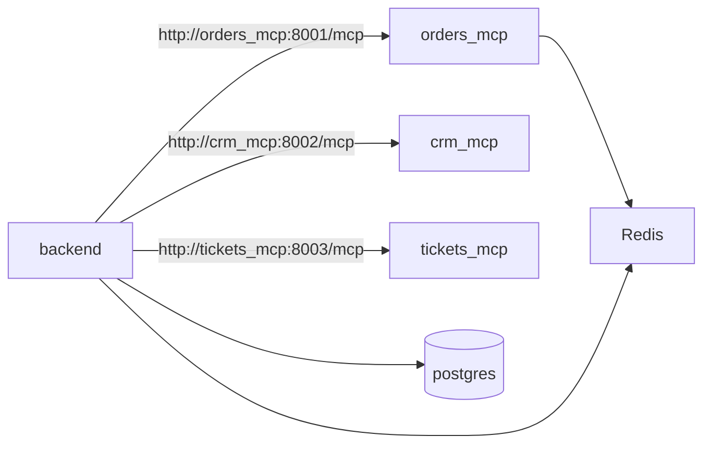

# docker-compose.yml

> **Source:** `docker-compose.yml`  
> **Purpose:** Orchestrates the entire Customer Support MCP platform as a multi-container Docker stack.

---

## Overview

This file defines **8 services** that run together:

| Service | Image / Build | Port | Role |
|---------|---------------|------|------|
| `postgres` | `postgres:16-alpine` | 5432 | Persistent storage for users, conversations, approvals, LangGraph checkpoints |
| `redis` | `redis:7-alpine` | 6379 | Caching for order/customer lookups |
| `orders_mcp` | Built from `mcp_servers/orders` | 8001 | MCP server for order operations |
| `crm_mcp` | Built from `mcp_servers/crm` | 8002 | MCP server for customer data |
| `tickets_mcp` | Built from `mcp_servers/tickets` | 8003 | MCP server for support tickets |
| `backend` | Built from `backend` | 8000 | FastAPI + LangGraph agent + MCP clients |
| `frontend` | Built from `frontend` | 8501 | Streamlit chat UI |
| `prometheus` | `prom/prometheus:latest` | 9090 | Metrics scraping |

---

## Service details

### postgres

- **Database:** `support`, user `user`, password `password`
- **Init script:** `./db/init.sql` mounted to `/docker-entrypoint-initdb.d/init.sql` — runs on first startup
- **Health check:** `pg_isready` every 5 seconds
- **Volume:** `pgdata` for persistent data

### redis

- Used by `orders_mcp` (server-side cache) and `backend` (client-side cache)
- **Health check:** `redis-cli ping`

### orders_mcp

```yaml
environment:
  - JWT_SECRET=your-secret-key
  - PORT=8001
  - REDIS_URL=redis://redis:6379/0
```

- Validates JWT tokens on every tool call
- Connects to Redis for order detail caching
- MCP endpoint: `http://orders_mcp:8001/mcp`

### crm_mcp / tickets_mcp

- Simpler servers without JWT (tenant isolation enforced at data layer)
- Ports 8002 and 8003 respectively

### backend

Key environment variables:

| Variable | Value | Purpose |
|----------|-------|---------|
| `OPENAI_API_KEY` | From `.env` | Default LLM key (overridable per WebSocket message) |
| `JWT_SECRET` | `your-secret-key` | Must match orders MCP server |
| `POSTGRES_URL` | `postgresql+asyncpg://...` | Async DB connection |
| `ORDERS_MCP_URL` | `http://orders_mcp:8001/mcp` | MCP client target |
| `CRM_MCP_URL` | `http://crm_mcp:8002/mcp` | MCP client target |
| `TICKETS_MCP_URL` | `http://tickets_mcp:8003/mcp` | MCP client target |

**Depends on:** postgres (healthy), redis (healthy), all three MCP servers (started)

### frontend

```yaml
environment:
  - BACKEND_URL=ws://backend:8000/ws/chat
  - JWT_SECRET=your-secret-key
```

- Streamlit app connects to backend WebSocket inside the Docker network
- Exposed at http://localhost:8501

### prometheus

- Mounts `./monitoring/prometheus.yml`
- Scrapes `backend:8000/metrics` every 15 seconds

---

## MCP connection diagram



---

## Volumes

| Volume | Used by | Purpose |
|--------|---------|---------|
| `pgdata` | postgres | Database files |
| `redisdata` | redis | Redis persistence |

---

## How to use

```bash
# Start everything
docker compose up --build

# Start in background
docker compose up -d --build

# Stop and remove containers
docker compose down

# Stop and remove volumes (wipes DB)
docker compose down -v
```

---

## MCP novice notes

- Each MCP server is a **separate container** — this mirrors production where tools live in independent microservices.
- The `/mcp` path is the standard Streamable HTTP endpoint; backend clients connect to `http://<host>:<port>/mcp`.
- Service names (`orders_mcp`, `backend`) are DNS names inside the Docker network — that's why URLs use hostnames, not `localhost`.
