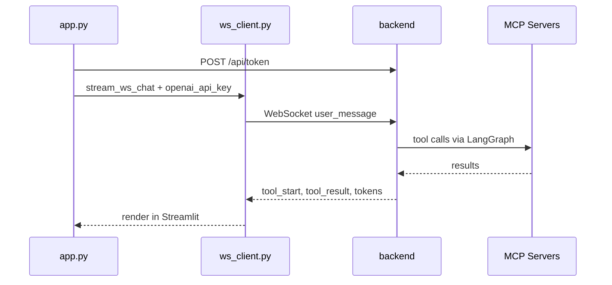

# frontend/app.py

> **Source:** `frontend/app.py`  
> **Purpose:** Streamlit chat UI — user authentication, OpenAI key input, real-time agent streaming, and human-in-the-loop refund approval.

---

## Imports

| Import | Library | Why used |
|--------|---------|----------|
| `streamlit as st` | `streamlit` | Web UI framework |
| `asyncio` | stdlib | Run async WebSocket client in sync Streamlit |
| `requests` | `requests` | HTTP call to `/api/token` for JWT |
| `uuid` | stdlib | Generate unique thread IDs |
| `os` | stdlib | Read `BACKEND_URL`, `OPENAI_API_KEY` env vars |
| `stream_ws_chat, send_ws_approval` | `ws_client` | WebSocket event generators |

---

## Configuration

| Variable | Default | Description |
|----------|---------|-------------|
| `BACKEND_WS_URL` | `ws://backend:8000/ws/chat` | WebSocket endpoint |
| `BACKEND_HTTP_URL` | Derived from WS URL | HTTP base for token API |

---

## Session state keys

| Key | Purpose |
|-----|---------|
| `token` | JWT access token |
| `role`, `tenant_id`, `user_id` | From selected demo user |
| `thread_id` | LangGraph conversation thread |
| `messages` | Chat history for display |
| `approval_request` | Pending human approval event |
| `openai_api_key` | User-entered OpenAI key |

---

## Sidebar features

### OpenAI API Key input

Password field — key stored **only in browser session**, sent per WebSocket message as `openai_api_key`.

### Demo user selection

| Display name | user_id | tenant | role |
|--------------|---------|--------|------|
| Alice Admin | user_admin_1 | tenant_a | admin |
| Bob Support | user_support_1 | tenant_a | support |
| Charlie Viewer | user_viewer_1 | tenant_a | viewer |
| Dave Admin | user_admin_2 | tenant_b | admin |
| Eve Support | user_support_2 | tenant_b | support |

**Log In** → POST `/api/token` → stores JWT in session state.

### Thread management

- Edit `thread_id` manually
- **New Conversation Thread** → generates `thread_{uuid}`

---

## Async functions

### `run_chat_stream(content)`

**Logic flow:**
1. Append user message to session
2. Connect via `stream_ws_chat(..., openai_api_key=...)`
3. Handle events:

| Event `type` | UI action |
|--------------|-----------|
| `thinking` | Show "Analyzing request..." |
| `tool_start` | Info box with tool name |
| `tool_result` | Expandable code block |
| `token` | Stream markdown response |
| `human_approval` | Store approval request, rerun |
| `final` | Save assistant message, rerun |
| `error` | Show error |

### `run_approval_stream(approved)`

Sends `approval_response` via `send_ws_approval`, streams completion events.

---

## Human-in-the-loop UI

When `approval_request` is set:
- Warning banner with order ID and amount
- **Approve Refund** / **Deny Refund** buttons
- Calls `run_approval_stream(True/False)`

---

## MCP connection

The UI never talks to MCP directly — it sees MCP activity through `tool_start` and `tool_result` WebSocket events.

---

## MCP novice notes

- You must enter an OpenAI key **and** log in before chatting.
- Try refunding `ord_102` ($1,200) as Alice Admin to see human-in-the-loop in action.
- Bob Support cannot refund (role lacks `refund_order_v1`) — demonstrates RBAC.
