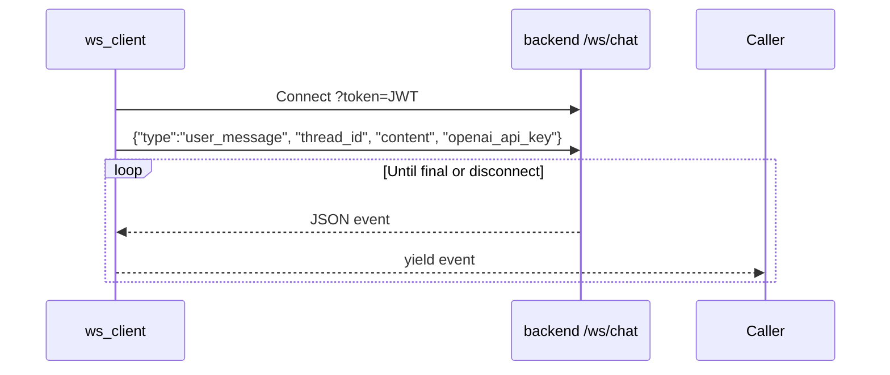

# frontend/ws_client.py

> **Source:** `frontend/ws_client.py`  
> **Purpose:** Async WebSocket client for communicating with the backend chat API — sends messages and yields streaming events.

---

## Imports

| Import | Library | Why used |
|--------|---------|----------|
| `json` | stdlib | Serialize/deserialize WebSocket messages |
| `asyncio` | stdlib | Async I/O |
| `websockets` | `websockets` | WebSocket client protocol |
| `logging` | stdlib | Connection logging |

---

## Function: `stream_ws_chat(backend_url, token, thread_id, content, openai_api_key=None)`

**Parameters:**

| Param | Type | Description |
|-------|------|-------------|
| `backend_url` | `str` | e.g. `ws://backend:8000/ws/chat` |
| `token` | `str` | JWT (appended as `?token=`) |
| `thread_id` | `str` | LangGraph thread |
| `content` | `str` | User message text |
| `openai_api_key` | `str \| None` | Optional per-session OpenAI key |

**Yields:** Event dicts from server (`thinking`, `token`, `tool_start`, etc.)

**Logic flow:**



Stops when `type == "final"` received.

On error → yields `{"type": "error", "message": "..."}`.

---

## Function: `send_ws_approval(backend_url, token, thread_id, approved, openai_api_key=None)`

**Parameters:** Same as above plus `approved: bool`

**Yields:** Events until `final`

**Sends:**
```json
{
  "type": "approval_response",
  "thread_id": "...",
  "approved": true,
  "openai_api_key": "sk-..."
}
```

Opens a **new** WebSocket connection for each approval (not reusing the chat connection).

---

## MCP connection

This client doesn't interact with MCP directly. It receives **proxied MCP events**:

| Server event | Meaning |
|--------------|---------|
| `tool_start` | Backend started an MCP tool call |
| `tool_result` | MCP tool returned a result |

---

## MCP novice notes

- JWT goes in the **query string** (`?token=...`), not the message body — matches `websocket.py` auth.
- `openai_api_key` is included in every message so the backend can use the sidebar key without server-side storage.
- Each chat message opens a new WebSocket, streams until `final`, then closes.
