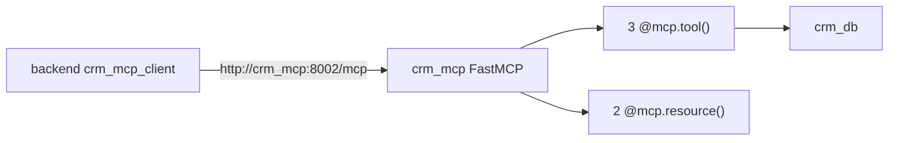

# mcp_servers/crm/server.py

> **Source:** `mcp_servers/crm/server.py`  
> **Purpose:** CRM MCP server — customer lookup, updates, and notes via FastMCP with Streamable HTTP transport.

---

## Imports

| Import | Library | Why used |
|--------|---------|----------|
| `os, json, logging` | stdlib | Config, serialization, logging |
| `Dict, Optional` | `typing` | Type hints |
| `FastMCP` | `mcp.server.fastmcp` | MCP server framework |
| `crm_db` | `db` | Mock CRM database |

---

## Server initialization

```python
mcp = FastMCP("crm_mcp", host="0.0.0.0", port=int(os.getenv("PORT", 8002)))
```

Runs with `mcp.run(transport="streamable-http")` at `/mcp`.

**No JWT auth** in this server — tenant isolation enforced at data layer only.

---

## MCP Tools

### `get_customer(tenant_id, customer_id) -> str`

Returns customer JSON or `not_found` error.

### `update_customer(tenant_id, customer_id, email=None, phone=None) -> str`

Updates email and/or phone. Returns updated customer.

### `customer_notes(tenant_id, customer_id, note) -> str`

Appends note to customer profile.

---

## MCP Resources

### `crm://customer-profile/{customer_id}`

Searches across `tenant_a` and `tenant_b` for a customer and returns a formatted profile string.

### `crm://customer-history/{customer_id}`

Returns purchase history as formatted text.

**MCP concept:** Parameterized resources (`{customer_id}`) let clients fetch context without calling tools.

---

## MCP connection



---

## MCP novice notes

CRM demonstrates MCP **resources** — read-only data endpoints. The LangGraph agent in this repo uses tools only, but MCP clients could also fetch `crm://customer-profile/cust_101` for richer context.
