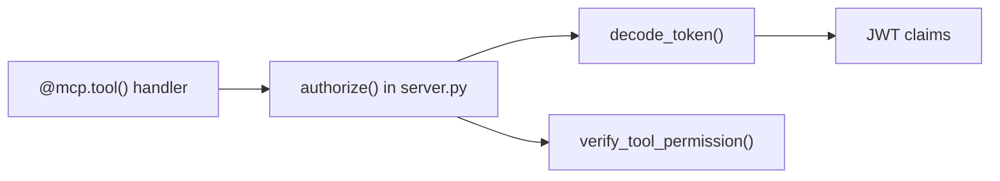

# mcp_servers/orders/auth.py

> **Source:** `mcp_servers/orders/auth.py`  
> **Purpose:** JWT decoding and role-based tool permissions for the Orders MCP server.

---

## Imports

| Import | Library | Why used |
|--------|---------|----------|
| `os` | stdlib | Read `JWT_SECRET` env var |
| `Dict, Optional` | `typing` | Type hints |
| `jwt, JWTError` | `jose` | JWT decode |

---

## Constants

| Name | Value | Source |
|------|-------|--------|
| `JWT_SECRET` | `"your-secret-key"` default | `JWT_SECRET` env var |
| `ALGORITHM` | `"HS256"` | Fixed |

Must match `backend/config.py` and `docker-compose.yml`.

---

## Function: `decode_token(token: str) -> Optional[Dict]`

**Parameters:** JWT string  
**Returns:** Claims dict (`user_id`, `tenant_id`, `role`, `exp`) or `None`

Uses `jwt.decode` with signature verification.

---

## Function: `verify_tool_permission(role: str, tool_name: str) -> bool`

**Parameters:** Role and tool name  
**Returns:** `True` if allowed

| Role | Allowed tools |
|------|---------------|
| `admin` | All 4 order tools |
| `support` | `search_orders_v1`, `get_order_details_v1`, `cancel_order_v1` |
| `viewer` | `search_orders_v1`, `get_order_details_v1` |

**Note:** Slightly different from backend `permissions.py` — support can `cancel_order_v1` here but not `refund_order_v1`.

---

## MCP connection

Called by every tool in `orders/server.py` before accessing `orders_db`.

---

## MCP novice notes

MCP servers can enforce their own auth independently of the client. This is **defense in depth** — even if someone bypasses the LangGraph agent and calls the MCP server directly, JWT validation still applies.
