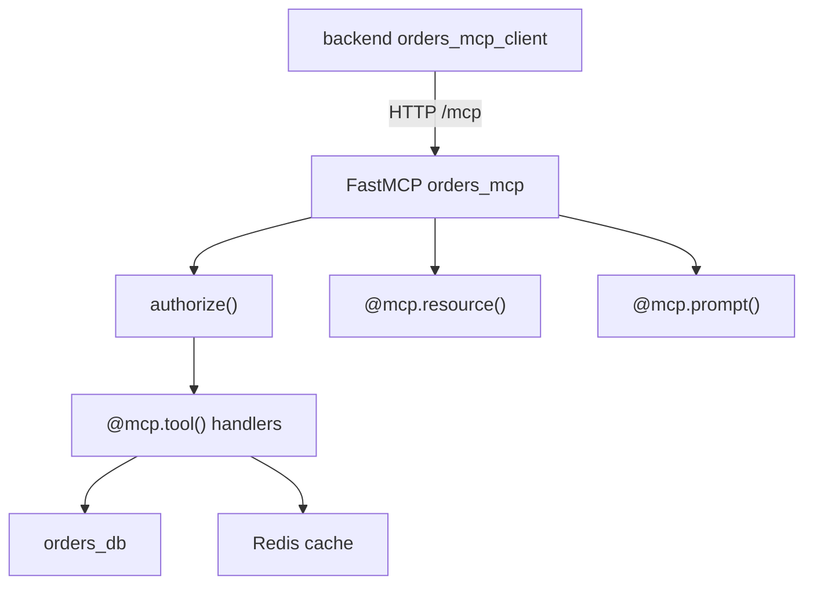

# mcp_servers/orders/server.py

> **Source:** `mcp_servers/orders/server.py`  
> **Purpose:** Orders MCP server — exposes order search, details, refund, and cancel tools plus resources and prompts via FastMCP.

---

## Imports

| Import | Library | Why used |
|--------|---------|----------|
| `os, json, logging` | stdlib | Config, serialization, logging |
| `Optional, List` | `typing` | Type hints |
| `FastMCP` | `mcp.server.fastmcp` | **MCP server framework** |
| `redis` | `redis` | Server-side order caching |
| `orders_db` | `db` | Mock order database |
| `decode_token, verify_tool_permission` | `auth` | JWT validation and RBAC |

---

## Server initialization

```python
mcp = FastMCP("orders_mcp", host="0.0.0.0", port=int(os.getenv("PORT", 8001)))
```

At runtime: `mcp.run(transport="streamable-http")` → serves MCP at **`/mcp`**

---

## Function: `authorize(token, tool_name, requested_tenant) -> dict`

**Returns:** `{"user_id", "tenant_id", "role"}` or raises `ValueError`

**Checks:**
1. JWT valid (`decode_token`)
2. Token `tenant_id` matches `requested_tenant`
3. Role permitted for `tool_name` (`verify_tool_permission`)

---

## MCP Tools

### `search_orders_v1(tenant_id, token, user_id=None) -> str`

Search orders for a tenant. Returns JSON list or permission error.

### `get_order_details_v1(tenant_id, token, order_id) -> str`

Get single order with **Redis caching** (300s TTL). Cache key: `order_cache:{tenant_id}:{order_id}`

### `refund_order_v1(tenant_id, token, order_id, reason) -> str`

Refund order. Logs if amount > $1000 (LangGraph handles actual approval gate). Invalidates cache.

### `cancel_order_v1(tenant_id, token, order_id, reason) -> str`

Cancel order. Invalidates cache.

---

## MCP Resources

### `orders://refund-policy`

Read-only resource returning the company refund policy text, including the $1,000 approval rule.

**MCP concept:** Resources are data the AI can **read** (like files), unlike tools which **act**.

---

## MCP Prompts

### `executive_summary(order_id) -> str`

Returns a prompt template for summarizing an order for executives.

**MCP concept:** Prompts are reusable templates the host can fetch and fill in.

---

## Entry point

```python
if __name__ == "__main__":
    mcp.run(transport="streamable-http")
```

---

## MCP architecture



---

## MCP novice notes

- **FastMCP** turns Python functions into MCP tools with the `@mcp.tool()` decorator — minimal boilerplate.
- **Streamable HTTP** at `/mcp` is the transport — clients use `streamable_http_client` from the `mcp` package.
- This server is the most secured: JWT + tenant + role checks on every tool call.
