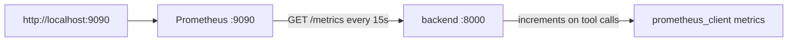

# monitoring/prometheus.yml

> **Source:** `monitoring/prometheus.yml`  
> **Purpose:** Prometheus scrape configuration — tells Prometheus where to collect metrics from the backend.

---

## Configuration breakdown

### Global settings

```yaml
global:
  scrape_interval: 15s      # How often to scrape targets
  evaluation_interval: 15s  # How often to evaluate alerting rules
```

### Scrape job: `support-backend`

```yaml
scrape_configs:
  - job_name: 'support-backend'
    metrics_path: '/metrics'
    static_configs:
      - targets: ['backend:8000']
```

| Field | Value | Meaning |
|-------|-------|---------|
| `job_name` | `support-backend` | Label applied to all metrics from this target |
| `metrics_path` | `/metrics` | HTTP path served by `backend/api/metrics.py` |
| `targets` | `backend:8000` | Docker network hostname of the backend container |

---

## Metrics exposed by the backend

Defined in `backend/api/metrics.py`:

| Metric | Type | Labels | Description |
|--------|------|--------|-------------|
| `tool_calls_total` | Counter | `tool_name`, `tenant_id`, `status` | MCP tool invocations |
| `tool_failures_total` | Counter | `tool_name`, `error_type` | Failed tool calls |
| `tool_latency_seconds` | Histogram | `tool_name` | Tool execution duration |
| `active_sessions` | Gauge | — | Open WebSocket connections |

---

## Architecture



---

## How to view metrics

1. Start the stack: `docker compose up`
2. Open http://localhost:9090
3. Try queries like:
   - `tool_calls_total`
   - `active_sessions`
   - `rate(tool_calls_total[5m])`

---

## MCP novice notes

Prometheus does **not** scrape MCP servers directly. Tool metrics are recorded in the **backend** when the LangGraph agent calls MCP tools via the WebSocket streaming path (`api/websocket.py`). This gives you observability into how often the AI uses each MCP tool.
