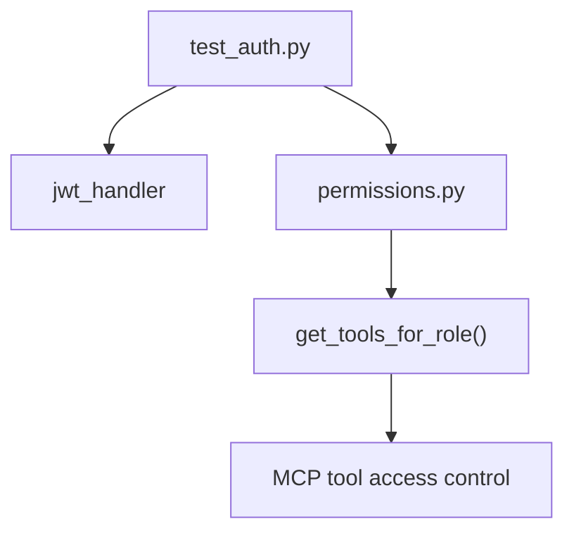

# tests/test_auth.py

> **Source:** `tests/test_auth.py`  
> **Purpose:** Unit tests for JWT token generation/decoding and role-based permission checks.

---

## Imports

| Import | Library | Why used |
|--------|---------|----------|
| `sys, os` | stdlib | Path setup (redundant with conftest) |
| `pytest` | `pytest` | Test framework |
| `timedelta` | `datetime` | Short-lived test token |
| `create_access_token, decode_token` | `auth.jwt_handler` | JWT functions under test |
| `has_permission, filter_permitted_tools` | `auth.permissions` | RBAC functions under test |

---

## Test: `test_jwt_generation_and_decoding()`

**Verifies:**
1. `create_access_token` returns a non-empty string
2. `decode_token` recovers `user_id`, `tenant_id`, `role`

Uses 5-minute expiration for test isolation.

---

## Test: `test_role_permissions()`

**Verifies `has_permission` for all three roles:**

| Role | Can refund? | Can search orders? | Can create ticket? |
|------|-------------|-------------------|-------------------|
| admin | ✅ | ✅ | ✅ |
| support | ❌ | ✅ | ✅ |
| viewer | ❌ | ✅ | ❌ |

These permissions gate which MCP tools the LangGraph agent can call.

---

## Test: `test_filter_permitted_tools()`

**Verifies:** `filter_permitted_tools("support", tools)` removes `refund_order_v1` from the list.

Simulates what happens when MCP `list_tools` output is filtered before binding to the LLM.

---

## MCP connection

Auth tests ensure the **gatekeeper layer** works before MCP tools are ever invoked.

---

## MCP novice notes

These are fast unit tests — no Docker, no MCP servers needed. They validate the security model that protects MCP tool calls.
