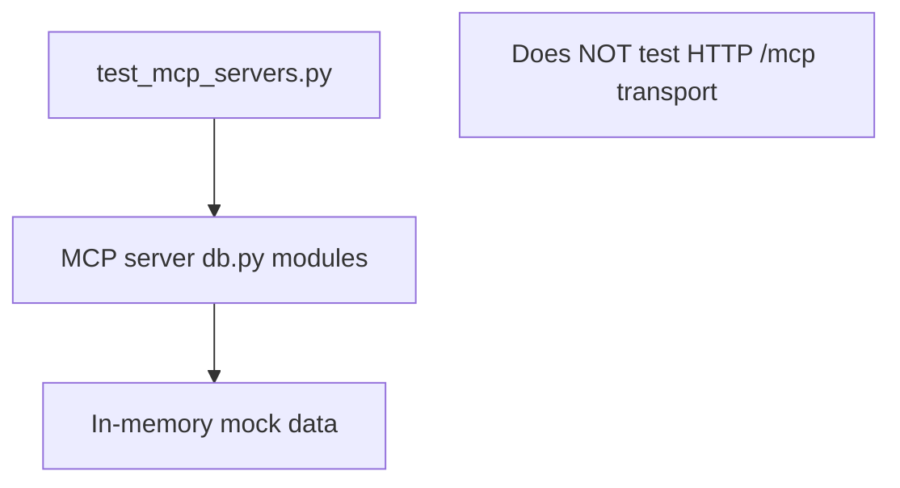

# tests/test_mcp_servers.py

> **Source:** `tests/test_mcp_servers.py`  
> **Purpose:** Integration tests for MCP server mock databases — validates data layer behavior without running MCP servers.

---

## Imports

| Import | Library | Why used |
|--------|---------|----------|
| `sys, os` | stdlib | Path resolution |
| `pytest` | `pytest` | `@pytest.mark.asyncio` |
| `importlib.util` | stdlib | Dynamic module loading |

---

## Helper: `import_module_from_path(module_name, file_path)`

Dynamically imports `db.py` from each MCP server directory without package installation.

Loads:
- `mcp_servers/orders/db.py` → `orders_db`
- `mcp_servers/crm/db.py` → `crm_db`
- `mcp_servers/tickets/db.py` → `tickets_db`

---

## Test: `test_orders_db_search_and_refund()` (async)

**Verifies:**
1. `search_orders("tenant_a")` returns orders including `ord_101`
2. **Tenant isolation** — `ord_201` (tenant_b) not in tenant_a results
3. `get_order_details("tenant_a", "ord_101")` → amount $150
4. `refund_order` succeeds and sets status to `refunded`

---

## Test: `test_crm_db()` (async)

**Verifies:**
1. `get_customer("tenant_a", "cust_101")` → Alice Johnson, gold tier
2. `add_customer_note` appends note text

---

## Test: `test_tickets_db()` (async)

**Verifies:**
1. `search_tickets("tenant_a")` returns existing tickets
2. `create_ticket` generates new ticket with correct subject/priority

---

## MCP connection

These tests validate the **data behind MCP tools** — if these pass but MCP calls fail, the issue is in transport/auth, not data.

---

## MCP novice notes

To test actual MCP protocol communication, you'd add tests using `streamable_http_client` against running servers. These tests focus on the simpler data layer for fast CI feedback.
