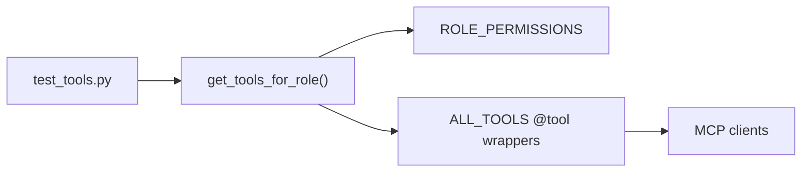

# tests/test_tools.py

> **Source:** `tests/test_tools.py`  
> **Purpose:** Unit tests for LangChain tool role filtering — verifies the LLM only receives permitted MCP-backed tools.

---

## Imports

| Import | Library | Why used |
|--------|---------|----------|
| `sys, os` | stdlib | Path setup |
| `pytest` | `pytest` | Test framework |
| `get_tools_for_role, ALL_TOOLS` | `graph.tools` | Functions under test |

---

## Test: `test_get_tools_for_role()`

**Verifies tool sets per role:**

### Admin
- Has: `search_orders_v1`, `refund_order_v1`, `create_ticket`
- Full access to all 10 tools

### Support
- Has: `search_orders_v1`, `create_ticket`
- Lacks: `refund_order_v1`

### Viewer
- Has: `search_orders_v1`
- Lacks: `refund_order_v1`, `create_ticket`

---

## MCP connection

`get_tools_for_role` determines which MCP tool schemas GPT-4o sees. If `refund_order_v1` is not in the list, the LLM cannot request a refund — the first line of MCP access control.

---

## MCP novice notes

This test doesn't call MCP servers. It validates the **tool visibility layer** — a critical security control in MCP agent architectures where the LLM should never see tools it's not allowed to use.
